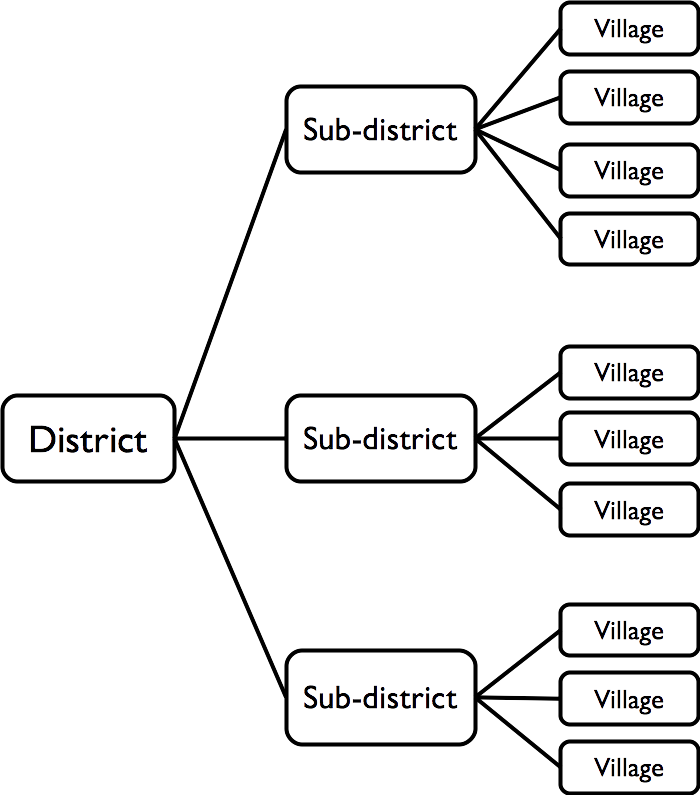

# Sampling {#sampling}

## The RAM-OP sample 

RAM-OP uses a two-stage sample:

**First stage sample:** A sample of communities (e.g. villages or city-blocks) in the survey area is
taken. A sampled community is also called a primary sampling unit (PSU).

**Second stage sample:** Domestic dwellings are sampled from within the communities selected in the
first stage sample. All eligible individuals in the sampled dwelling are included in the sample.


### The first-stage sample

The first stage sample is a systematic spatial sample. Two methods can be used and both methods take the sample from all parts of the survey area:

**List-based method:** Communities to be sampled are selected systematically from a complete list of communities in the survey area. This list of communities is sorted by one or more non-overlapping spatial factors such as district and subdistricts within districts:

&nbsp;

```{r sample1, echo = FALSE, fig.cap = "Communities listing by district and sub-district", fig.align = "center", fig.retina = 1}

```

&nbsp;

**Map-based method:** Communities to be sampled are selected from the centres of the squares of a grid drawn over a map. The map must be sufficiently well made and of sufficiently large scale to show the position of every community in the survey area. This type of sample is known as a centric systematic area sample and is often referred to as a CSAS sample.

**Note:** *Population proportional sampling* (PPS) is **not** used in RAM-OP surveys. Population estimates for all communities are **not** required for sampling purposes. Population estimates are required only for the selected communities. These are used during data analysis in order to weight results by population size. If this information is not available before the survey, it can be collected during the survey.

### The second stage sample
The second stage within-community sample uses a method called map-segment-sample. This method takes the within-community sample from all parts of a sampled community.


## Implicit stratification

Both the first and second stage samples use a form of spatial stratification:

* The list-based method's first stage systematic spatial sample stratifies the sample by non-overlapping
spatial factor such as districts and subdistricts within districts.

* The map-based (CSAS) method's first stage sample stratifies the sample by grid square.

* The map-segment-sample second stage within-community sample stratifies the sample by parts of the community being sampled.

* The first and second stage samples also ensure that a reasonably even spatial sample is taken from the entire survey area and from each of the sampled communities.

These sampling procedures provide implicit stratification and tend to spread the sample properly among important sub-groups of the population such as rural / urban / peri-urban populations, administrative areas, ethnic sub-populations, religious sub-populations, and socio-economic groups. This often improves the precision of estimates made from survey data.

The use of implicit stratification improves the efficiency of a two-stage cluster sample and allows RAM-OP to use relatively small sample sizes compared to other methods, such as SMART surveys. The use of modern computer-intensive data analysis techniques also allows RAM-OP to make better use of the available sample than is done in other methods.


## RAM-OP survey sample size

The following shorthand symbols will be used when describing sample designs:

&nbsp;

$m = \text{Number of primary sampling units (PSUs).}$

$n = \text{Size of the sample of individuals or households from a PSU. May also mean the overall survey sample size (this meaning will be made clear in the text).}$

$N = \text{Population}$

&nbsp;

The overall sample size for a RAM-OP survey is about $n = 192$ individual subjects. You should aim to collect
an overall sample of at least $n = 192$ individuals. 

The RAM-OP sample is collected in two stages:

* The first stage sample uses a sample size of about $m = 16$ communities (or PSUs).
* The second stage sample uses a sample size of about $n = 12$ eligible subjects sampled from each of
the communities selected for inclusion in the first stage sample.

The overall sample size from $m = 16$ communities and $n = 12$ eligible subjects is about:

&nbsp;

$$ \text{overall sample size} ~ \approx ~ m ~ \times ~ n ~ \approx ~ 16 ~ \times ~ 12 ~ \approx ~ 192 $$

&nbsp;

It is not recommended that fewer than $m = 16$ communities are sampled.


## RAM-OP survey sample size

Sampling fewer than $m = 16$ communities will tend to reduce the precision with which estimates can be made. If you have the resources to sample more than $m = 16$ communities then you should do so. A sample of $m = 24$ communities and $n = 8$ eligible subjects, for example, will tend to yield estimates with better precision than a sample with $m = 16$ communities and $n = 12$ eligible subjects.

Do not be tempted to increase the size of the within-community sample in order to achieve an overall sample size of $n = 192$ from fewer than $m = 16$ communities. Doing so will tend to reduce the precision with which estimates are made. It may also be impossible to do this in many settings.

Here, for example, is a *population pyramid* for a typical developing country:

&nbsp;

```{r sample2, echo = FALSE, fig.cap = "Population pyramid for a typical developing country", fig.align = "center", fig.retina = 1}

```

&nbsp;

If the average community population is $N = 300$ then there will be fewer than 15 people aged 60 years and older in about half of the selected communities. This is because about half of the selected communities are likely to have a population below the average population.

