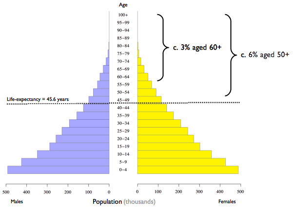
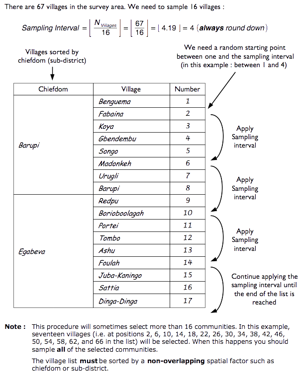
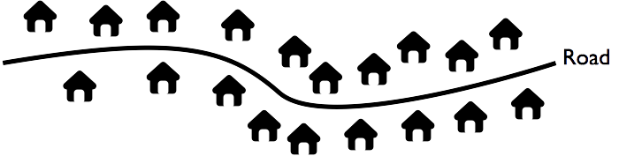
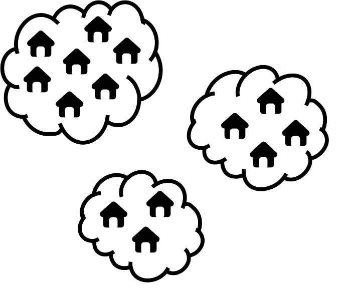
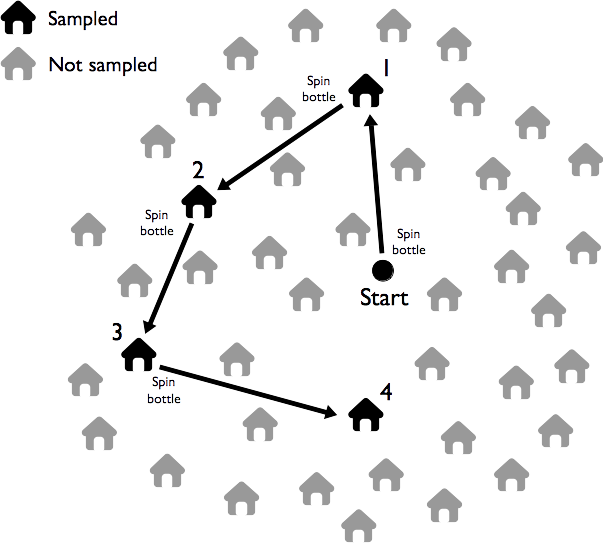

# Sampling {#sampling}

## The RAM-OP sample 

RAM-OP uses a two-stage sample:

**First stage sample:** A sample of communities (e.g. villages or city-blocks) in the survey area is
taken. A sampled community is also called a primary sampling unit (PSU).

**Second stage sample:** Domestic dwellings are sampled from within the communities selected in the
first stage sample. All eligible individuals in the sampled dwelling are included in the sample.

### The first-stage sample

The first stage sample is a systematic spatial sample. Two methods can be used and both methods take the sample from all parts of the survey area:

* **List-based method:** Communities to be sampled are selected systematically from a complete list of communities in the survey area. This list of communities is sorted by one or more non-overlapping spatial factors such as district and subdistricts within districts:

```{r sample1, echo = FALSE, fig.cap = "Communities listing by district and sub-district", fig.align = "center", fig.pos = "H", fig.retina = 1}
knitr::include_graphics("figures/listSample1.png")
```

* **Map-based method:** Communities to be sampled are selected from the centres of the squares of a grid drawn over a map. The map must be sufficiently well made and of sufficiently large scale to show the position of every community in the survey area. This type of sample is known as a centric systematic area sample and is often referred to as a CSAS sample.

**Note:** *Population proportional sampling* (PPS) is **not** used in RAM-OP surveys. Population estimates for all communities are **not** required for sampling purposes. Population estimates are required only for the selected communities. These are used during data analysis in order to weight results by population size. If this information is not available before the survey, it can be collected during the survey.

### The second stage sample
The second stage within-community sample uses a method called map-segment-sample. This method takes the within-community sample from all parts of a sampled community.

## Implicit stratification

Both the first and second stage samples use a form of spatial stratification:

* The list-based method's first stage systematic spatial sample stratifies the sample by non-overlapping
spatial factor such as districts and subdistricts within districts.

* The map-based (CSAS) method's first stage sample stratifies the sample by grid square.

* The map-segment-sample second stage within-community sample stratifies the sample by parts of the community being sampled.

* The first and second stage samples also ensure that a reasonably even spatial sample is taken from the entire survey area and from each of the sampled communities.

These sampling procedures provide *implicit stratification* and tend to spread the sample properly among important sub-groups of the population such as rural / urban / peri-urban populations, administrative areas, ethnic sub-populations, religious sub-populations, and socio-economic groups. This often improves the precision of estimates made from survey data.

The use of implicit stratification improves the efficiency of a two-stage cluster sample and allows RAM-OP to use relatively small sample sizes compared to other methods, such as SMART surveys. The use of modern computer-intensive data analysis techniques also allows RAM-OP to make better use of the available sample than is done in other methods.

## RAM-OP survey sample size

The following shorthand symbols will be used when describing sample designs:

\begin{align*}
m &= \text{Number of primary sampling units (PSUs).} \\
n &= \text{Size of the sample of individuals or households from a PSU.} \\
n &= \text{May also mean the overall survey sample size (this meaning will be made clear in the text).} \\
N &= \text{Population}
\end{align*}

The overall sample size for a RAM-OP survey is about $n = 192$ individual subjects. You should aim to collect
an overall sample of at least $n = 192$ individuals. 

The RAM-OP sample is collected in two stages:

* The first stage sample uses a sample size of about $m = 16$ communities (or PSUs).

* The second stage sample uses a sample size of about $n = 12$ eligible subjects sampled from each of
the communities selected for inclusion in the first stage sample.

The overall sample size from $m = 16$ communities and $n = 12$ eligible subjects is about:

$$ \text{overall sample size} ~ \approx ~ m ~ \times ~ n ~ \approx ~ 16 ~ \times ~ 12 ~ \approx ~ 192 $$

It is not recommended that fewer than $m = 16$ communities are sampled.

## RAM-OP survey sample size

Sampling fewer than $m = 16$ communities will tend to reduce the precision with which estimates can be made. If you have the resources to sample more than $m = 16$ communities then you should do so. A sample of $m = 24$ communities and $n = 8$ eligible subjects, for example, will tend to yield estimates with better precision than a sample with $m = 16$ communities and $n = 12$ eligible subjects.

Do not be tempted to increase the size of the within-community sample in order to achieve an overall sample size of $n = 192$ from fewer than $m = 16$ communities. Doing so will tend to reduce the precision with which estimates are made. It may also be impossible to do this in many settings.

Here, for example, is a *population pyramid* for a typical developing country:

```{r sample2, echo = FALSE, fig.cap = "Population pyramid for a typical developing country", fig.align = "center", fig.pos = "H", fig.retina = 1}

```

If the average community population is $N = 300$ then there will be fewer than 15 people aged 60 years and older in about half of the selected communities. This is because about half of the selected communities are likely to have a population below the average population.

## Eligibility

Older people are usual defined as persons aged 60 years and older (UN definition). This means your sample will usually be restricted to people aged 60 years and older.

In some settings different eligibility criteria may apply. This will likely be the case in settings with very high life-expectancies (usually middle and high income countries) or very low life-expectancies (usually low income countries and in emergencies).

In a setting of very high life-expectancy you may want to restrict eligibility - to persons aged 65 years or older, for example. A local definition of older people is likely to be available.

In a setting with very low life-expectancy, very few people are aged 60 years or older. For example:

```{r sample3, echo = FALSE, fig.cap = "Population pyramid for a setting with low life-expectancy", fig.align = "center", fig.pos = "H", fig.retina = 1}

```

It is common in such setting for there to be a local definition of older people. This will usually be “persons
aged 50 years or older” or “persons aged 55 years or older”.

## Age distribution, eligibility criteria, and sample design

The age distribution of the population and the survey eligibility criteria will affect the sample design in terms of the number of communities that you will need to sample ($m$) and the number of older persons ($n$) that can be sampled from each community.

The overall sample size for a RAM-OP sample should be at least $n = 192$ usually collected as $n = 12$ eligible subjects sampled from $m = 16$ communities. If older people make up a very small proportion (i.e. much less than 5%) of the total population and / or the average population of communities is small then you will usually need to sample more than m = 16 communities in order to get about $n = 192$ older people in the overall sample. This is likely to occur when there are fewer than 20 to 25 older people in a community of average size.

You can calculate the number of older people that you would expect to be living in a community of average size using the following formula:

$$ n_{\text{aged 60+ in an average village}} ~ = ~ \text{average village population}_{\text{all ages}} ~ \times ~ \frac{\text{percentage of population}_{\text{aged 60+}}}{100} $$

If this is below about 20 people then you should consider how you will collect the required overall sample size. Three approaches may be used:

* **Relax the eligibility criteria:** You may decide to define older people as “persons aged 50 years or older” or “persons aged 55 years or older”. This may double the size of the eligible population and make the sample easier to collect. This approach is only reasonable if life-expectancy is low.

* **Increase the number of communities that you plan to sample:** You may choose to collect your sample as $n = 7$ eligible subjects sampled from $m = 30$ communities giving an expected overall sample size of $n = 210$. This would be a very good sample. The disadvantage of this approach is that survey costs increase with the number of communities that are sampled, because a lot of survey time and vehicle costs are spent on travelling to and from the selected communities.

* **Take a “top-up” sample only when you need to:** The basic procedure when a selected community is small and likely to contain fewer than $n = 12$ older people is to collect data on all older people in the selected community using a door-to-door census. If the within-community sample size is much smaller than the required one then a “top-up” sample is taken from the nearest neighbouring community using the map-segment-sample method (or a door-to-door census if this community is also small). The advantage of this approach is that travelling time and survey costs are better controlled.

If the proportion of older people is not very small and / or communities are large then you should have no problems achieving the overall sample size.

## Practical sampling

### The first stage sample - list-based sampling

The first stage sample can be drawn from a list of all communities. The list-based sample is a simple systematic sample taken from a complete list of communities in the survey area sorted by one or more non- overlapping spatial factors (such as administrative units or electoral wards) in the survey area. *Population proportional sampling* (PPS) is not used since this would concentrate the sample in the larger communities.

Below is a worked example of how a RAM-OP first stage, list-based sample can be drawn from a survey area composed of 67 villages.

**Step 1:** Calculate the *sampling interval* by dividing the total villages in the survey area (67 villages) with the number of villages to be drawn from the sample (16 villages).

$$ \text{Sampling Interval} ~ = ~ \left \lfloor ~ \frac{N_{villages}}{N_{sample}} ~ \right \rfloor ~ = ~ \left \lfloor ~ \frac{67}{16} ~ \right \rfloor ~ \approx ~ \left \lfloor ~ 4.19 ~ \right \rfloor ~ \approx ~ 4 $$

The *sampling interval* needs to be a whole number. Remember to **always** *round down* when calculating the *sampling interval* to the nearest whole number.

**Step 2:** Choose a *random starting point* between 1 and *sampling interval*. In this example, this would be a random number **between 1 and 4**.

A random number can be selected through simple lottery (i.e., draw from a lot of 4 numbered from 1 to 4). A standard spreadsheet software can also be used to draw the random number using the `RANDBETWEEN` function as follows:

`RANDBETWEEN(1, 4)`

**Step 3:** Using the *random starting point* and the *sampling interval*, select the sampling villages from a list of all villages organised/sorted by a **non-overalapping** spatial factor such as district or sub-district.


```{r sample4, echo = FALSE, fig.cap = "Selection of sampling villages using lists", fig.align = "center", fig.pos = "H", fig.retina = 1}

```

This procedure will sometimes select more than 16 communities.In this example, seventeen villages (i.e. at positions 2, 6, 10, 14, 18, 22, 26, 30, 34, 38, 42, 46, 50, 54, 58, 62, and 66 in the list) will be selected.When this happens you should sample **all** of the selected communities.

### The first stage sample - map-based sampling

An alternative approach to list-based sampling is to use map-based sampling. The map-based (CSAS) sample selects communities from the centre of squares of a grid drawn over a map. The map must be sufficiently well made and of sufficiently large scale to show the position of **all** communities in the survey area.

A square grid is drawn over the map. The size of the grid squares should be small enough so that the number of squares covering the survey area is the same as (or very similar to) the number of communities that you plan to sample. You may need to experiment with different grid sizes to achieve this. Figure \@ref(fig:sample6) shows an example map and grid with $m = 16$ grid squares.

The sample is drawn by selecting the community that is located closest to the centre of each grid square:

```{r sample5, echo = FALSE, fig.cap = "Selection of sampling villages using maps", fig.align = "center", fig.pos = "H", fig.retina = 1}
knitr::include_graphics("figures/mapSample1.png")
```

If two or more villages are located the same distance from the centre of a grid square then a single village is picked at random, by tossing a coin for example.

Figure \@ref(fig:sample7) shows the sample selected by this process for the area shown in Figure \@ref(fig:sample6).

```{r sample6, echo = FALSE, fig.cap = "Drawing a square grid over the map", fig.align = "center", fig.pos = "H", fig.retina = 1}
knitr::include_graphics("figures/mapSample2.png")
```

```{r sample7, echo = FALSE, fig.cap = "Drawing the first-stage CSAS sample", fig.align = "center", fig.pos = "H", fig.retina = 1}
knitr::include_graphics("figures/mapSample3.png")
```

Both the list-based and the map-based (CSAS) sampling methods spread the sample of communities evenly across the entire survey area. Each community has an equal chance of being included in the sample. Population proportional sampling (PPS) is not used since this would concentrate the sample in the larger communities.

The same method can be used when sampling in urban contexts. Figure \@ref(fig:sample8) shows a sample drawn from a list of census enumeration areas sorted by administrative district. Figure \@ref(fig:sample9) shows a sample drawn using the map- based (CSAS) method. In both cases the primary sampling units (PSUs) are census enumeration areas.

```{r sample8, echo = FALSE, fig.cap = "Example of an urban sample (list-based)", fig.align = "center", fig.pos = "H", fig.retina = 1}
knitr::include_graphics("figures/mapSample4.png")
```

```{r sample9, echo = FALSE, fig.cap = "Example of an urban sample (map-based)", fig.align = "center", fig.pos = "H", fig.retina = 1}
knitr::include_graphics("figures/mapSample5.png")
```
**Note:** In this example twenty-one (21) blocks have been selected. It can be difficult to achieve exactly the number of blocks that you need when using this type of sample. It is best to select more rather than fewer blocks than you need
Here we would take our sample as $n = 10$ individuals from $m = 21$ blocks (overall $n = 210$).


### The second stage (within-community) sample

The second stage (within-community) sample uses a map-segment-sample approach:

**Map:** Make a rough map of the community to be sampled. It is helpful to think of communities as being made of ribbons (i.e. lines of dwellings located along roads, tracks, or rivers) and clusters of dwellings. 

Here is an example of a ribbon of dwellings:

```{r sample10, echo = FALSE, fig.cap = "Example of a ribbon of dwellings", fig.align = "center", fig.pos = "H", fig.retina = 1}

```

Here is an example of a cluster of dwellings:

```{r sample11, echo = FALSE, fig.cap = "Example of a cluster of dwellings", fig.align = "center", fig.pos = "H", fig.retina = 1}
knitr::include_graphics("figures/stage2sample2.png")
```

**Segment:** Divide the community into ribbon and cluster segments defined by the physical layout of the community being sampled.

**Sample:** Ribbons and clusters are sampled in different ways:

* **Ribbons** are sampled using **systematic sampling**.
* **Clusters** are sampled using a **random walk** method.

**Note:** If a small community is selected that is likely to have fewer than the required number of eligible persons then **all** eligible persons in that community are sampled by moving door-to-door.

### Mapping the community - single and multiple clusters

Some communities consist of a single cluster of dwellings:

```{r sample12, echo = FALSE, fig.cap = "Example of a cluster of dwellings", fig.align = "center", fig.pos = "H", fig.retina = 1}
knitr::include_graphics("figures/stage2sample2.png")
```

or a set of clusters of dwellings:

```{r sample13, echo = FALSE, fig.cap = "Example of a set of clusters of dwellings", fig.align = "center", fig.pos = "H", fig.retina = 1}

```

For communities (or parts of communities) structured in this way we use a sampling method called the **random walk**.

### Mapping the community - ribbon communities

Ribbon communities have dwellings arranged in a line:

```{r sample14, echo = FALSE, fig.cap = "Dwellings arranged in a line", fig.align = "center", fig.pos = "H", fig.retina = 1}

```

or in a several lines:

```{r sample15, echo = FALSE, fig.cap = "Dwellings arranged in several lines", fig.align = "center", fig.pos = "H", fig.retina = 1}
knitr::include_graphics("figures/stage2sample4.png")
```

For communities (or parts of communities) structured in this way we use a sampling method called **systematic sampling**.

### Mapping the community - mixed communities

Some communities are a mixture of clusters and ribbons:

```{r sample16, echo = FALSE, fig.cap = "Mixture of clusters and ribbons", fig.align = "center", fig.pos = "H", fig.retina = 1}
knitr::include_graphics("figures/stage2sample5.png")
```

For mixed communities we use a mixture of the **random walk** method (in the clusters) and **systematic sampling** (along the ribbons).

**Segmentation** involves dividing a community into several parts and taking part of the within-community sample from each **segment**. With simple communities, segmentation is not required and we take a single sample from the entire community using the appropriate sampling method.

### Segmentation

For more complicated communities we divide the community into several parts or segments, such as a community made up of several clusters:

```{r sample17, echo = FALSE, fig.cap = "Example of a set of clusters of dwellings", fig.align = "center", fig.pos = "H", fig.retina = 1}

```

or a community made up of several ribbons:

```{r sample18, echo = FALSE, fig.cap = "Dwellings arranged in several lines", fig.align = "center", fig.pos = "H", fig.retina = 1}
knitr::include_graphics("figures/stage2sample4.png")
```

or a mixed community:

```{r sample19, echo = FALSE, fig.cap = "Mixture of clusters and ribbons", fig.align = "center", fig.pos = "H", fig.retina = 1}
knitr::include_graphics("figures/stage2sample5.png")
```

We take a small sample from each segment using the appropriate sampling method.

For example, with a community made up of three segments:

```{r sample20, echo = FALSE, fig.cap = "Community made up of three segments", fig.align = "center", fig.pos = "H", fig.retina = 1}
knitr::include_graphics("figures/stage2sample6.png")
```

we would take one third of the overall sample from each segment.

If the within-community sample size is twelve eligible subjects. we would sample four eligible subjects from each segment (i.e. $12 / 3 = 4$).

Dividing the sample up in this way means that we will sample from every part of the community rather than just one part of the community.

When taking the sample we use the random walk method to take part of the sample from clusters and the systematic sampling method to take part of the sample from ribbons.

Segments should be either ribbons or clusters but should **never** contain both a ribbon and a cluster. This is because clusters and ribbons are sampled in different ways.

A dwelling can only belong to one segment. Segments should **not** overlap.


### Sample dwellings

**All** segments should be sampled.

If, for example, there are five segments in a community:

```{r sample21, echo = FALSE, fig.cap = "Community made up of five segments", fig.align = "center", fig.pos = "H", fig.retina = 1}
knitr::include_graphics("figures/stage2sample7.png")
```

and the within-community sample size is twelve eligible subjects, then you would plan to sample two eligible subjects from each segment (i.e. $12 / 5 = 2.4$ **rounded down** to two) and, if necessary, return to the **largest** segment to complete the sample.

**All** segments should be sampled, even if this means that you take a larger sample than you expected to. 

Remember that different types of segment are sampled in different ways:

* Dwellings in **cluster segments** are sampled using a method called the **random walk**. This involves sampling houses by walking in random directions within the cluster.

* Dwellings in **ribbon segments** are sampled using a method called **systematic sampling**. This involves sampling houses at regular intervals along the ribbon.

We will look at each of these sampling methods in turn.


### Random walk sampling

The **random walk** method is used to sample dwellings in **cluster segments**. Sampling proceeds as follows:

1. Move to the approximate centre of the cluster.

2. Select a **random direction** by spinning a bottle on the ground. The neck indicates the **sampling direction**. This is the direction you should walk in order to sample a dwelling. Walk in the sampling direction counting the dwellings that you pass. Sample the third **dwelling**. If there are no eligible persons in the selected dwelling then sample the **nearest** dwelling with an eligible person. Sample **all** eligible persons in the selected dwelling.

3. Apply the survey questionnaire for **all** eligible persons in the selected dwelling.

4. Select the next dwelling to sample by spinning a bottle and walking in the indicated direction. Count the dwellings you pass. Sample the **third** dwelling. If there are no eligible persons in the selected dwelling then sample the **nearest** dwelling with an eligible person. Sample all eligible persons in the selected dwelling. If you reach the edge of the cluster segment then return to the centre of the cluster and repeat step (2) above. Remember to keep count of the number of eligible persons sampled from the segment.

5. Stop sampling in the segment when you have sampled the required number of eligible persons from the segment. Since you sample **all** eligible persons in a selected dwelling, you may sample a few more eligible persons than expected. This is OK. Always sample **all** eligible persons in a selected dwelling.

If, when you have sampled all segments, you have not sampled twelve eligible persons, you should return to the **largest** segment to finish sampling using the appropriate sampling method.

The random walk method is illustrated in Figure \@ref(fig:sample22).

```{r sample22, echo = FALSE, fig.cap = "Random walk sampling in a cluster segment", fig.align = "center", fig.pos = "H", fig.retina = 1}

```

### Systematic sampling

The **systematic sampling** method is used to sample houses in **ribbon segments**. 

Sampling proceeds as follows:

1. Move to one end of the ribbon segment.

2. Walk to the other end of the segment counting the houses that you pass.

3. Calculate the **step size** by dividing the number of dwellings in the segment by the required sample size for the segment. Use the **whole number** part of the result only. Do **not** round up.

4. Pick a random number between one and the step size. This is your **starting point**. Select the first dwelling to sample by walking along the segment counting the dwellings that you pass and sample the dwelling indicated by the **starting point**. If there are no eligible persons in the selected dwelling then sample the **nearest** dwelling in any direction with an eligible person. Sample **all** eligible persons in the selected dwelling.

5. Select the next dwelling to sample by walking along the segment. Count the dwellings that you pass. Sample the dwelling indicated by the **step size**. If there are no eligible persons in the selected dwelling then sample the **nearest** dwelling in any direction with an eligible person. Sample **all** eligible persons in the selected dwelling.

6. Stop sampling in the segment when you reach the end of the ribbon segment. This may mean that you sample extra eligible persons. This is OK. Do **not** stop sampling from a ribbon until you reach the end of the ribbon.

If, when you have sampled all segments, you have not sampled twelve eligible persons, you should return to the **largest** segment to finish sampling using the appropriate sampling method.

The systematic sampling method is illustrated in Figure \@ref(fig:sample23).

```{r sample23, echo = FALSE, fig.cap = "Systematic sampling in a ribbon segment", fig.align = "center", fig.pos = "H", fig.retina = 1}
knitr::include_graphics("figures/stage2sample9.png")
```

### Sampling in urban settings

In urban areas the first stage sample is taken by replacing sub-districts with “sections” and communities with city blocks. Examples of sections may be administrative districts/sub-districts or electoral wards.

```{r sample24, echo = FALSE, fig.cap = "Administrative divisions in an urban setting", fig.align = "center", fig.pos = "H", fig.retina = 1}
knitr::include_graphics("figures/stage2sample10.png")
```

Census enumeration areas (EAs) are usually city blocks. Central statistics offices can usually provide lists of EAs by “section” and large-scale maps of EAs selected for sampling (See Figure \@ref(fig:sample25) and Figure \@ref(fig:sample26)). These maps make it easy to locate EAs and their boundaries. The sample of EAs can be decided using list-based or map-based (CSAS) sampling.

In these settings, eligible persons may be sampled by moving from door-to-door. All dwellings in the selected block are sampled and all eligible persons in the selected dwellings are sampled. This means that all eligible persons in a selected block are sampled.

If city blocks are large then a type of systematic sampling may be used. With this method a rough map of the streets in the block is made and the number of doorways on each street is counted and copied onto the rough street map (as shown in Figure \@ref(fig:sample27)). The total number of doorways on all streets is calculated. A step size is calculated by dividing the total number of doorways on all streets by the number of dwellings to be sampled. A systematic sample along a route around the block that includes all streets in the block is taken. Streets can be sampled in any order. If you find that you have sampled all streets but have not yet sampled the required number of eligible persons then you should return to the street with the largest number of houses to collect the remainder of the sample.

The number of blocks to be sampled will depend on the expected number of eligible persons in each block. You should aim for an overall sample size of about $n = 192$. You should not sample fewer than $m = 16$ blocks.

```{r sample25, echo = FALSE, fig.cap = "Enumeration area map for a city block in Freetown, Sierra Leone", fig.align = "center", fig.pos = "H", fig.retina = 1}
knitr::include_graphics("figures/stage2sample11.png")
```

```{r sample26, echo = FALSE, fig.cap = "Enumeration area map for a city block in Addis Ababa, Ethiopia", fig.align = "center", fig.pos = "H", fig.retina = 1}
knitr::include_graphics("figures/stage2sample12.png")
```

```{r sample27, echo = FALSE, fig.cap = "Systematic sampling in a city block", fig.align = "center", fig.pos = "H", fig.retina = 1}
knitr::include_graphics("figures/stage2sample13.png")
```

When useful lists and maps are not available then satellite imagery available though free services such as Google Earth (http://earth.google.com) may be used.

The quality (resolution) of the images available from these services is variable but is usually good enough to allow you to segment the town into small areas of approximately equal volume (approximately the same number of dwellings) in each:

```{r sample28, echo = FALSE, fig.cap = "Segmenting a town into smaller sampling areas", fig.align = "center", fig.pos = "H", fig.retina = 1}
knitr::include_graphics("figures/stage2sample14.png")
```

When creating segments using maps or satellite images it is a good idea to use main roads, rivers, canals, railway lines, public parks, etc as boundaries. This simplifies the segmentation process and also simplifies fieldwork by making areas and their boundaries easier to locate and sample.

The first stage sample can be list-based (such as where each area is numbered in a systematic north to south and east to west order and a systematic sample taken) or map-based (CSAS).

Larger scale “maps” of blocks to be sampled can also me made using satellite imagery (see Figure \@ref(fig:sample29)).

```{r sample29, echo = FALSE, fig.cap = "A large scale “map” of a city block made from satellite imagery", fig.align = "center", fig.pos = "H", fig.retina = 1}
knitr::include_graphics("figures/stage2sample15.png")
```
