# Indicators {#indicators}

## The RAM-OP indicator set

RAM-OP surveys collect and report on data for a broad range of indicators relevant to older people.

These indicators cover the following dimensions:

* Demography and situation
* Food intake
* Severe food insecurity
* Disability
* Activities of daily living
* Mental health and well-being
* Dementia
* Health and health-seeking behaviour
* Sources of income
* Water, sanitation, and hygiene
* Anthropometry and screening coverage
* Visual impairment

Data for a small group of miscellaneous indicators are also collected and reported.

The RAM-OP indicator set has been designed on a modular basis. Each module is a set of indicators relating to a single dimension from the list given above and is collected using a dedicated set of questions and measurements. This means that the RAM-OP questionnaire also consists of a set of modules.

Whenever possible, RAM-OP uses standard and validated indicators and question sets.

Indicators are described below, showing the questionnaire components that are used to collect and record the data required, and flowcharts of the process used to derive indicators from the collected data. Standard symbols are used. For example:

```{r indicators01, echo = FALSE, fig.align = "center", fig.pos = "H", fig.retina = 1}
knitr::include_graphics("figures/indicators01.png")
```

A non-standard symbol is used to show **recode operations**. A recode operation shows changes that are made to data so that it can be used to derive indicators without having to show many decision nodes in the flowchart. They are also used to specify what should be done with missing or out-of-range values. For example:

```{r indicators02, echo = FALSE, fig.align = "center", fig.pos = "H", fig.retina = 1}
knitr::include_graphics("figures/indicators02.png")
```

### Demography and situation

The demography and situation indicators are used to describe the survey sample and are derived from this questionnaire component:

```{r questionnaire01, echo = FALSE, fig.align = "center", fig.pos = "H", fig.retina = 1}

```

\newpage

Each of the questions yields a separate indicator:

```{r indicators03, echo = FALSE, fig.align = "center", fig.pos = "H", fig.retina = 1}
knitr::include_graphics("figures/indicators03.png")
```

### Food intake

Food-intake indicators are derived from this questionnaire component. This data can be queried to yield a large number of useful indicators.

\newpage

```{r questionnaire02, echo = FALSE, fig.align = "center", fig.pos = "H", fig.retina = 1}

```


\newpage

There are three related sets of diet-related indicators:

* meal frequency
* food groups consumed / dietary diversity
* indicators of nutrient consumption.

The indicator hierarchy is:

```{r indicators04, echo = FALSE, fig.align = "center", fig.pos = "H", fig.retina = 1}
knitr::include_graphics("figures/indicators04.png")
```

The data on the number of meals taken in the previous twenty-four hours forms a *meal frequency score*. 

Food intake data from each subject is combined into a *dietary diversity score*. The dietary diversity score is a crude measure of food security. The dietary diversity score ranges between zero (i.e. no food groups) and eleven (i.e. eleven food groups). Higher values of the dietary diversity sore are associated with better food security.

The meal frequency score and the dietary diversity score follow:

* Swindale A, Bilinsky P, *Household Dietary Diversity Score (HDDS) for measurement of household food access: Indicator guide*.,Washington DC, Food and Nutrition Technical Assistance (FANTA) Project, 2006

* Kennedy G, Ballard T, Dop MC, *Guidelines for Measuring Household and Individual Dietary Diversity*, Rome, Food and Agricultural Organization, 2010

The data on the types of food consumed in the previous twenty-four hours are analysed in order to determine the diet’s content of specific micronutrients that are important for older people. This also follows Swindale & Bilinsky (2006) and Kennedy et al (2010), and:

* World Health Organisation, *The management of nutrition in major emergencies*, Geneva, WHO, 2000

### Meal frequency

The meal frequency score indicator is the answer given to the first food intake question:

```{r indicators05, echo = FALSE, fig.align = "center", fig.pos = "H", fig.retina = 1}
knitr::include_graphics("figures/indicators05.png")
```

Meal frequency is a crude measure of food security.

Higher values of meal frequency are associated with better food security.

### Food groups and dietary diversity

Questions relating to the consumption of individual food items / food types are combined to create food groups and the number of food groups consumed are counted to create a dietary diversity score:

```{r indicators06, echo = FALSE, fig.align = "center", fig.pos = "H", fig.retina = 1}
knitr::include_graphics("figures/indicators06.png")
```

The consumption of the eleven individual food groups and the dietary diversity score are reported separately.

The dietary diversity score is a crude measure of food security. The dietary diversity score ranges between zero (no food groups) and eleven (eleven food groups). Higher values of the dietary diversity score are associated with better food security.

### Indicators of nutrient consumption

**Overview**

Questions and combinations of questions relating to the consumption of individual food items and food types can be used to determine whether the reported diet is likely to be provide sufficient nutrients of various types:

```{r indicators07, echo = FALSE, fig.align = "center", fig.pos = "H", fig.retina = 1}

```

Each indicator is formed using logical “or” operations (i.e. the indicator is true if **any** of the constituent foods are consumed). For example, the indicator for the consumption of iron rich foods:

```{r indicators08, echo = FALSE, fig.align = "center", fig.pos = "H", fig.retina = 1}
knitr::include_graphics("figures/indicators08.png")
```

requires the consumption of one or more of green leafy vegetables, organ meats, meat, or fish and shellfish. Consumption of **any** of these foods is sufficient to indicate that the survey subject consumes iron rich food.

#### Protein rich foods

Indicators of consumption of protein rich foods from animal sources, plant source, and any / all sources are calculated as:

```{r indicators09, echo = FALSE, fig.align = "center", fig.pos = "H", fig.retina = 1}
knitr::include_graphics("figures/indicators09.png")
```

#### Vitamin A rich foods

Indicators of consumption of vitamin A rich foods from animal sources, plant source, and any / all sources are calculated as:

```{r indicators10, echo = FALSE, fig.align = "center", fig.pos = "H", fig.retina = 1}
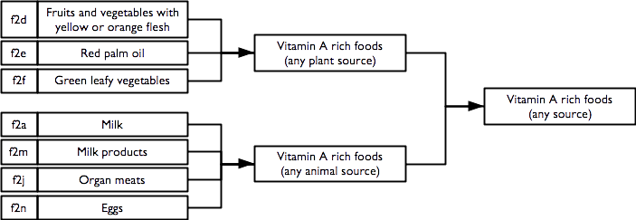
```

\newpage

#### Iron rich foods

An indicator of consumption of iron rich foods from any / all sources is calculated as:

```{r indicators11, echo = FALSE, fig.align = "center", fig.pos = "H", fig.retina = 1}
knitr::include_graphics("figures/indicators11.png")
```

#### Calcium rich foods

An indicator of consumption of calcium rich foods from any / all sources is calculated as:

```{r indicators12, echo = FALSE, fig.align = "center", fig.pos = "H", fig.retina = 1}
knitr::include_graphics("figures/indicators12.png")
```

#### Zinc rich foods

An indicator of consumption of zinc rich foods from any / all sources is calculated as:

```{r indicators13, echo = FALSE, fig.align = "center", fig.pos = "H", fig.retina = 1}

```

\newpage

#### Vitamin B rich foods

Indicators of consumption of vitamin B rich foods from any / all sources are calculated as:

```{r indicators14, echo = FALSE, fig.align = "center", fig.pos = "H", fig.retina = 1}
knitr::include_graphics("figures/indicators14.png")
```

Note that the vitamin B complex indicator requires that at least one food from each of the B1, B2, B3, B6, and B12 rich food combinations is consumed.

### Severe food insecurity

An indicator of severe food insecurity (hunger) is derived from this questionnaire component:

```{r questionnaire03, echo = FALSE, fig.align = "center", fig.pos = "H", fig.retina = 1}

```

and is calculated as:

```{r indicators15, echo = FALSE, fig.align = "center", fig.pos = "H", fig.retina = 1}
knitr::include_graphics("figures/indicators15.png")
```

\newpage

This indicator is the *Household Hunger Scale (HHS)* and is a simple, well-validated, and widely used indicator of severe food insecurity:

* Ballard T, Coates J, Swindale A, Deitchler M, *Household Hunger Scale: Indicator Definition and Measurement Guide*, Washington DC, FANTA-2 Bridge, FHI 360, 2011

* Ruel MT, Ballard TJ, Deitchler M, *Measuring and Tracking the Access Dimension of Food Security: Available Indicators and Recommendations for Future Investments*, Global Nutrition Report 2014: Technical Note 6, Washington DC, International Food Policy Research Institute, 2014

### Disability

Indicators of disability across six different domains are derived from this questionnaire component:

```{r questionnaire04, echo = FALSE, fig.align = "center", fig.pos = "H", fig.retina = 1}
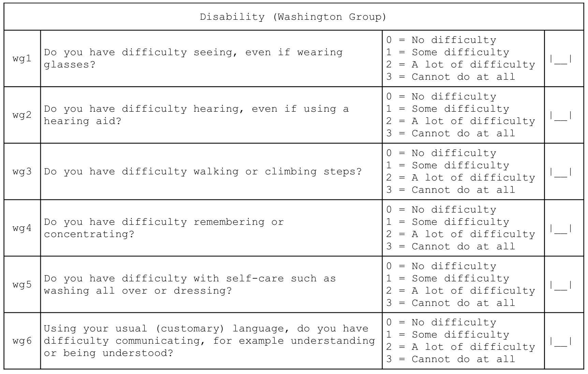
```

\newpage

Individual disability indicators are reported for each domain (i.e. vision, hearing, mobility, remembering, self-care, and communication) of disability in the Washington Group’s short set of question designed to identify people with a disability in a census or survey format:

* http://www.washingtongroup-disability.com

* https://www.cdc.gov/nchs/washington_group/wg_documents.htm

Overall disability prevalence indicators are also reported.

Indicators of disability in each domain are calculated as:

```{r indicators16, echo = FALSE, fig.align = "center", fig.pos = "H", fig.retina = 1}
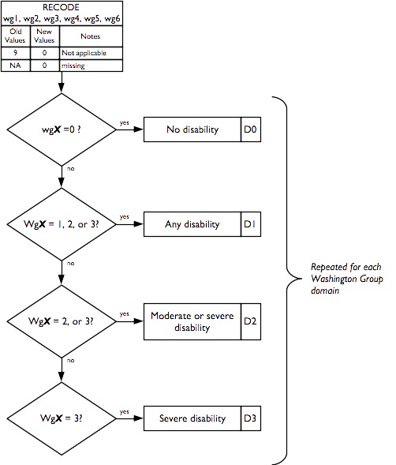
```

Overall disability prevalence indicators are calculated as:

+----------+----------------------------------------------------------------------------------+
| `P0` = 1 | if no domain has `D1` = 1, else = 0 (no disability in any domain)                |
+----------+----------------------------------------------------------------------------------+
| `P1` = 1 | if at least one domain has `D1` = 1, else = 0                                    |
+----------+----------------------------------------------------------------------------------+
| `P2` = 1 | if at least one domain has `D2` = 1, else = 0                                    |
+----------+----------------------------------------------------------------------------------+
| `P3` = 1 | if at least one domain has `D3` = 1, else = 0                                    |
+----------+----------------------------------------------------------------------------------+
| `PM` = 1 | if at more than one domain has `D1` = 1, else = 0 (M stands for “Multiple”)      |
+----------+----------------------------------------------------------------------------------+

### Activities of daily living

Indicators of how well the subject copes with activities of daily living are derived from this questionnaire component:

```{r questionnaire05, echo = FALSE, fig.align = "center", fig.pos = "H", fig.retina = 1}
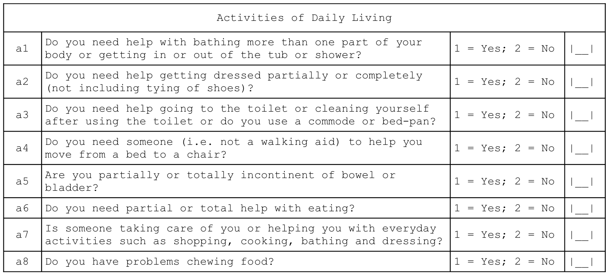
```

Individual *independence* indicators are reported for each dimension (i.e. bathing, dressing, toilet, mobility, continence, and eating) of daily living activities.

A composite indicator of the degree of *independence* (i.e. how well the subject can cope with activities of daily living) is also reported. This indicator is the *Katz Index of Independence in Activities of Daily Living* (or the *Katz Index of ADL* for short) and is a simple, well-validated, and widely used indicator of how well the subject can cope with activities of daily living:

* Katz S, Ford AB, Moskowitz RW, Jackson BA, Jaffe MW, *Studies of illness in the aged. The Index of ADL: A standardized measure of biological and psychosocial function*, JAMA, 185(12), 1963, pp. 914-9

* Katz S, Down TD, Cash HR, Grotz, RC, *Progress in the development of the index of ADL*, The Gerontologist, 10(1), 1970, pp. 20-30

* Katz S, *Assessing self-maintenance: Activities of daily living, mobility and instrumental activities of daily living*, JAGS, 31(12), 1983, pp. 721-726

The Katz Index of ADL ranges between zero (complete dependence) and six (independence).

\newpage

The seventh question of this module, which is not part of the Katz Index of ADL, is reported separately and indicates whether the subject has someone to help them with activities of daily living:

+:----------------------------------------------------------------------------------------------------------:+
| **Activities of Daily Living**                                                                             |
+------------------------------------------------------------------------------------------------------------+

+----------+--------------------------------------------------+------------------------------+---------------+
| a7       | Is someone taking care of you or helping you with| 1 = Yes; 2 = No              | [__]          |
|          | everyday activities such as shopping, cooking,   |                              |               |
|          | bathing and dressing?                            |                              |               |
+----------+--------------------------------------------------+------------------------------+---------------+

It is not possible to know if the help available completely meets a subject's needs, but we can identify the proportion of subjects needing help with one or more activities of daily living who also report not having someone to help them:

```{r indicators17, echo = FALSE, fig.align = "center", fig.pos = "H", fig.retina = 1}
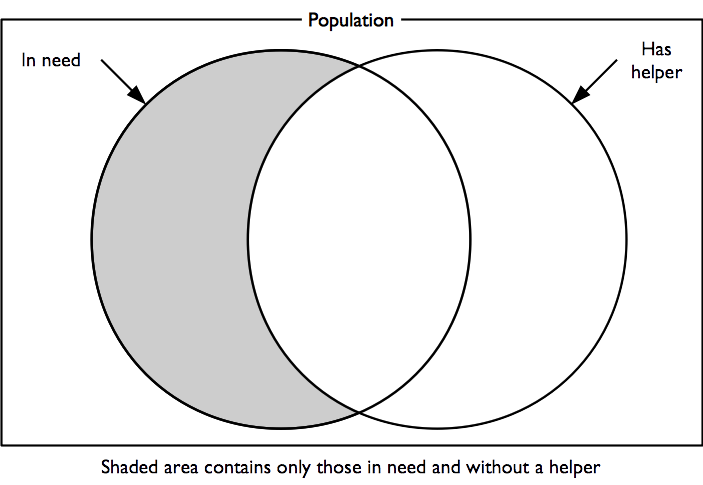
```

This is an indicator of unmet need.

\newpage

Indicators of how well the subject can cope with activities of daily living and probable unmet need are calculated as:

```{r indicators18, echo = FALSE, fig.align = "center", fig.pos = "H", fig.retina = 1}

```

### Mental health and well-being
Indicators of mental health and well being are derived from this questionnaire component:

```{r questionnaire06, echo = FALSE, fig.align = "center", fig.pos = "H", fig.retina = 1}
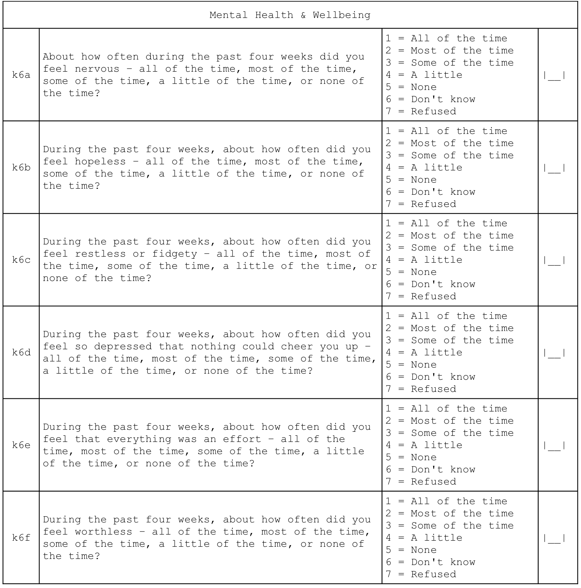
```

A score is calculated. This is the *Kessler K6 Psychological Distress Scale*. The score ranges from zero (indicating no psychological distress) to twenty-four (indicating severe psychological distress). A score of thirteen or more indicates serious psychological distress. The Kessler K6 Psychological Distress Scale is a widely recommended, widely used, accurate, reliable, and simple measure of psychological distress:

* Kessler RC, Andrews G, Colpe LJ, Hiripi E, Mroczek, DK, Normand SLT, et al, “Short screening scales to monitor population prevalences and trends in non-specific psychological distress”, *Psychological Medicine*, 32(6), 2002, pp. 959–976

* Kessler RC, Barker PR, Colpe LJ, Epstein JF, Gfroerer JC, Hiripi E, “Screening for Serious Mental Illness in the General Population”, *Archives of General Psychiatry*, 60(2), 2003, pp. 184-189

Indicators of mental health and well-being are calculated as:

```{r indicators19, echo = FALSE, fig.align = "center", fig.pos = "H", fig.retina = 1}

```

\newpage

### Dementia

An indicator of probable dementia is derived from this questionnaire component:

```{r questionnaire07, echo = FALSE, fig.align = "center", fig.pos = "H", fig.retina = 1}
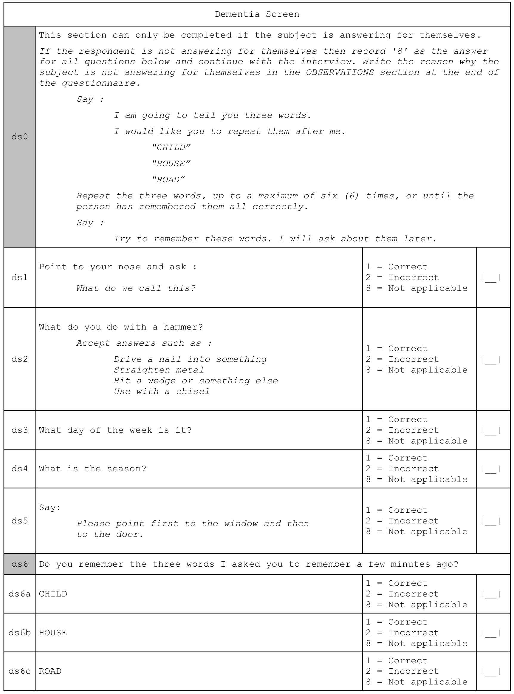
```

\newpage

The indicator of *probable* dementia is calculated as:

```{r indicators20, echo = FALSE, fig.align = "center", fig.pos = "H", fig.retina = 1}

```

This indicator is derived from the Community Screening Instrument for Dementia (CSID) developed by the 10/66 Dementia Research Group. This is a simple, validated, and widely used indicator of probable dementia:

* Prince M, et al, “A brief dementia screener suitable for use by non-specialists in resource poor settings - The cross-cultural derivation and validation of the brief Community Screening Instrument for Dementia”, *International Journal of Geriatric Psychiatry*, 26(9), 2011, pp. 899–907

\newpage

### Health and health-seeking behaviour

Indicators of health and health-seeking behaviour for chronic and acute conditions are derived from this questionnaire component:

```{r questionnaire08, echo = FALSE, fig.align = "center", fig.pos = "H", fig.retina = 1}

```

\newpage

Indicators of health and health-seeking behaviour for chronic conditions are calculated as:

```{r indicators21, echo = FALSE, fig.align = "center", fig.pos = "H", fig.retina = 1}
knitr::include_graphics("figures/indicators21.png")
```

\newpage

Indicators of health and health-seeking behaviour for acute conditions are calculated as:

```{r indicators22, echo = FALSE, fig.align = "center", fig.pos = "H", fig.retina = 1}
knitr::include_graphics("figures/indicators22.png")
```

### Sources of income

Indicators related to sources of income are derived from this questionnaire component:

```{r questionnaire09, echo = FALSE, fig.align = "center", fig.pos = "H", fig.retina = 1}
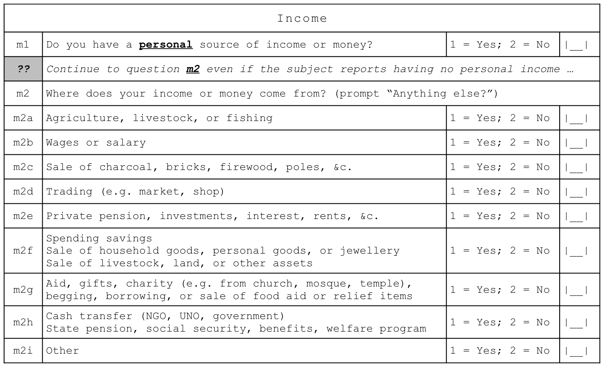
```

and are calculated as:

```{r indicators23, echo = FALSE, fig.align = "center", fig.pos = "H", fig.retina = 1}
knitr::include_graphics("figures/indicators23.png")
```

The grouped income sources (i.e. `m2a`, `m2b`, etc.) and individual income sources may vary between settings. The questionnaire component shown above has proved suitable for use in Ethiopia, South Sudan, and Tanzania.

\newpage

### Water, sanitation, and hygiene
Indicators relating to water, sanitation, and hygiene (WASH) are derived from this questionnaire component:

```{r questionnaire10, echo = FALSE, fig.align = "center", fig.pos = "H", fig.retina = 1}
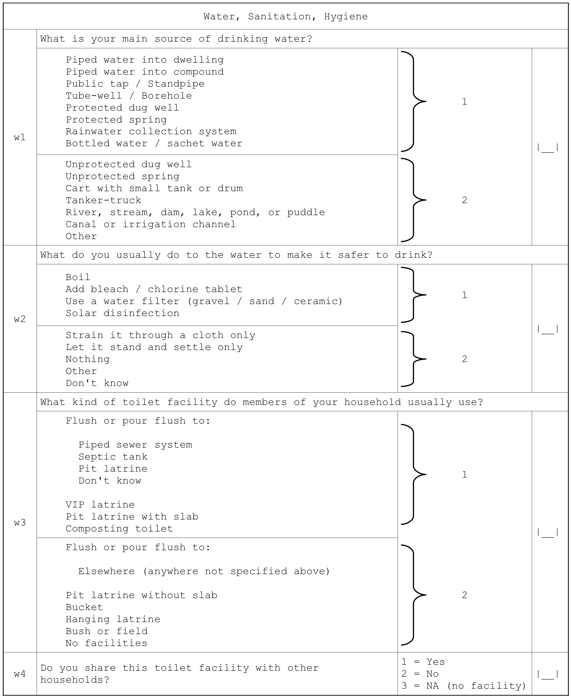
```

\newpage

Indicators are calculated following:

* WHO / UNICEF, *Core Questions on Drinking-water and Sanitation for Household Surveys*, Geneva, WHO / UNICEF, 2006

\newpage

Indicators relating to water, sanitation, and hygiene (WASH) are calculated as:

```{r indicators24, echo = FALSE, fig.align = "center", fig.pos = "H", fig.retina = 1}
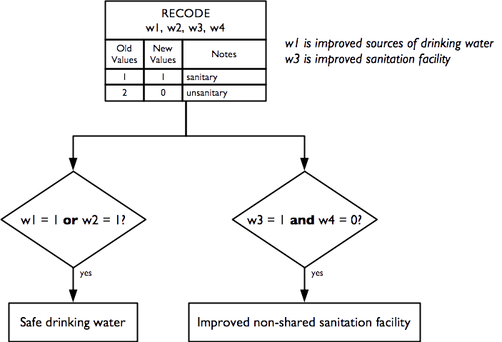
```

### Anthropometry and screening coverage**                                                                   

Indicators relating to anthropometry and screening coverage are derived from this questionnaire component:

```{r questionnaire11, echo = FALSE, fig.align = "center", fig.pos = "H", fig.retina = 1}
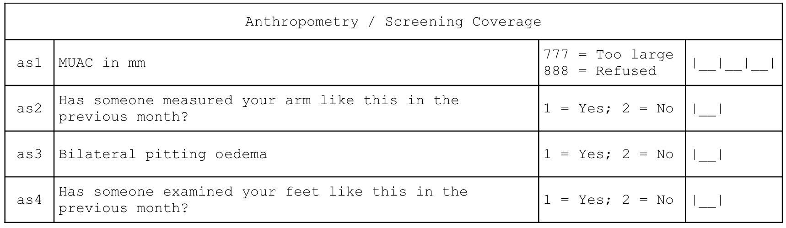
```

\newpage

And are calculated as:

```{r indicators25, echo = FALSE, fig.align = "center", fig.pos = "H", fig.retina = 1}
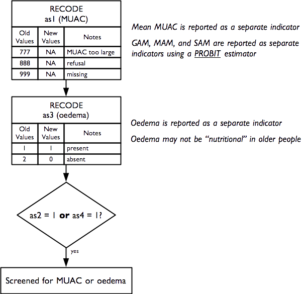
```

Raw MUAC data (i.e. not MUAC class) is collected, entered, and analysed. This requires that an adult MUAC tape (i.e. capable of measuring MUAC to 450 mm) is used.

The presence of bilateral oedema is assessed by pressing with your thumbs **both** feet of the older person for three seconds and checking whether this creates a lasting depression or “pit” on both feet. Bilateral pitting oedema in older people may not be “nutritional” oedema (as is almost always the case with children). Older people with bilateral pitting oedema should be advised to consult a doctor.

The prevalence of GAM, MAM, and SAM are estimated using a PROBIT estimator. This type of estimator provides better precision than a classic estimator at small sample sizes:

* World Health Organisation, *Physical Status: The use and interpretation of anthropometry. Report of a WHO expert committee*, WHO Technical Report Series 854, WHO, Geneva, 1995

* Dale NM, Myatt M, Prudhon C, Briend, A, “Assessment of the PROBIT approach for estimating the prevalence of global, moderate and severe acute malnutrition from population surveys”, *Public Health Nutrition*, 1–6. doi:10.1017/S1368980012003345, 2012

* Blanton CJ, Bilukha, OO, “The PROBIT approach in estimating the prevalence of wasting: revisiting bias and precision”, *Emerging Themes in Epidemiology*, 10(1), 2013, p. 8

The PROBIT estimator is described in Box 1.

MUAC-based case definitions for acute malnutrition are used:

+----------+-----------------------+
|	**GAM**	 | MUAC < 210 mm         |
+----------+-----------------------+
|	**MAM**	 | 185 mm ≤ MUAC < 210mm |
+----------+-----------------------+
|	**SAM**	 | MUAC < 185mm          |
+----------+-----------------------+

These are standard case definitions for acute malnutrition in adults and recommended by HelpAge International for use in older people in humanitarian contexts.

**Note** : MUAC in adults should be measured on the non-dominant arm. This is usually the left arm. The importance of high levels of accuracy and precision at the individual level is of lesser importance in survey work compared to case-finding or diagnosis in clinical contexts, for example. This means that a simple rule such as “Always measure MUAC on the left arm” may be used.

\newpage

```{block2, type = "rmdexercise"}
An estimate of GAM prevalence can be made using a classic estimator:

$$\text{prevalence} = \frac{\text{number of respondents with MUAC < 210 mm}}{\text{total number of respondents}}$$
  
The estimate of GAM prevalence made from the RAM-OP survey data is made using a PROBIT estimator. The PROBIT function is also known as the *inverse cumulative distribution* function. This function converts parameters of the distribution of an indicator (e.g. the mean and standard deviation of a *normally* distributed variable) into cumulative percentiles. This means that it is possible to use the normal PROBIT function with estimates of the mean and standard deviation of indicator values in a survey sample to predict (or estimate) the proportion of the population falling below a given threshold. For example, for data with a mean MUAC of 256 mm and a standard deviation of 28 mm the output of the normal PROBIT function for a threshold of 210 mm is 0.0502 meaning that 5.02% of the population are *predicted* (or *estimated*) to fall below the 210 mm threshold.

<br/>

Both the classic and the PROBIT methods can be thought of as estimating area:

<br/>
  
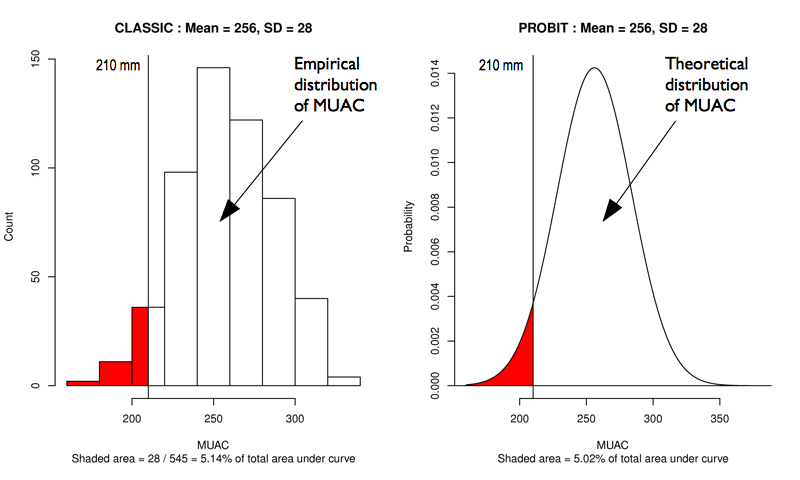

<br/>

The principal advantage of the PROBIT approach is that the required sample size is usually smaller than that required to estimate prevalence with a given precision using the classic method.

The PROBIT method assumes that MUAC is a normally distributed variable. If this is not the case then the distribution of MUAC is transformed towards normality.

The prevalence of SAM is estimated in a similar way to GAM. The prevalence of MAM is estimated as the difference between the GAM and SAM prevalence estimates:
  
$$\widehat{MAM prevalence} = \widehat{GAM prevalence} - \widehat{SAM prevalence}$$
```

\newpage

### Visual impairment

An indicator of visual impairment is derived from this questionnaire component:

```{r questionnaire12, echo = FALSE, fig.align = "center", fig.pos = "H", fig.retina = 1}

```

And is calculated as:

```{r indicators27, echo = FALSE, fig.align = "center", fig.pos = "H", fig.retina = 1}
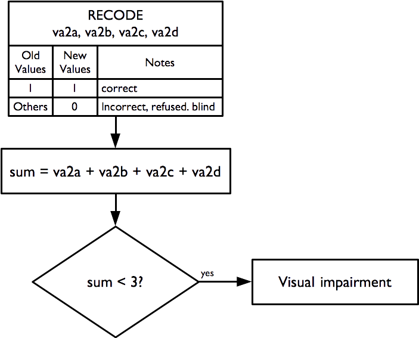
```

The “illiterate E” or “tumbling E” (the preferred term) is a validated and widely used method for measuring visual acuity:

* Taylor HR, “Applying new design principles to the construction of an illiterate E chart”, *American Journal of Optometry & Physiological Optics*, 55:348, 1978 

* Kaiser PK, “Prospective Evaluation of Visual Acuity Assessment: A Comparison of Snellen Versus ETDRS Charts in Clinical Practice (An AOS Thesis)”, *Transactions of the American Ophthalmological Society*, 107: 311–324, 2009

The size of the “E” used:

```{r indicators28, echo = FALSE, fig.align = "center", fig.pos = "H", fig.retina = 1}
knitr::include_graphics("figures/indicators28.png")
```

as well as the distance used for the test (two metres) and the indicator calculation apply the WHO case definition of visual impairment (i.e. visual acuity < 6 / 18).

The tumbling E card should be laminated (i.e. plastic coated and have a two metre cord attached which helps to ensure that the visual acuity test is performed at the correct distance (See Figure \@ref(fig:indicators29)).

After demonstrating to the respondent what the test is about (i.e. the subject should indicate which direction the branches of the 'E' are pointing), the test is administered at a distance of two meters, turning the card in four different directions, and asking the person to indicate which direction the branches of the “E” is pointing. If the subject wears glasses, they are allowed to use them during the test if they want to.

**Note** : If the person is unable to correctly answer at least three times out of four, they have a visual impairment. A simple visual acuity test such as the 'tumbling E' test also does not indicate anything about an underlying disease such as glaucoma or the need for reading spectacles (presbyopia). These conditions are common in people aged 60 years or older. Subjects failing the visual acuity test should be counselled to visit an ophthalmologist for a detailed eye examination.

```{r indicators29, echo = FALSE, fig.cap = "Equipment used to measure visual acuity", fig.align = "center", fig.pos = "H", fig.retina = 1}

```

### Miscellaneous indicators

Data for a small group of miscellaneous indicators are also collected and reported. These are derived from these questions:

+:----------------------------------------------------------------------------------------------------------:+
| **Hunger – Ration - Relief**                                                                               |
+------------------------------------------------------------------------------------------------------------+

+----------+--------------------------------------------------+------------------------------+---------------+
| f6       | Are you or anyone in your household receiving a  | 1 = Yes; 2 = No              | [__]          |
|          | food ration on a regular basis?                  |                              |               |
+----------+--------------------------------------------------+------------------------------+---------------+
| f7       | Have you or another member of your household     | 1 = Yes; 2 = No              | [__]          |
|          | received non-food relief items such as soap,     |                              |               |
|          | bucket, water container, bedding, mosquito net,  |                              |               |
|          | clothes, or plastic sheet in the previous four   |                              |               |
|          | weeks?                                           |                              |               |
+----------+--------------------------------------------------+------------------------------+---------------+

+:----------------------------------------------------------------------------------------------------------:+
| **Activities of Daily Living**                                                                             |
+------------------------------------------------------------------------------------------------------------+

+----------+--------------------------------------------------+------------------------------+---------------+
| a8       | Do you have problems chewing food?               | 1 = Yes; 2 = No              | [__]          |
+----------+--------------------------------------------------+------------------------------+---------------+

and are calculated as:

```{r indicators30, echo = FALSE, fig.align = "center", fig.pos = "H", fig.retina = 1}
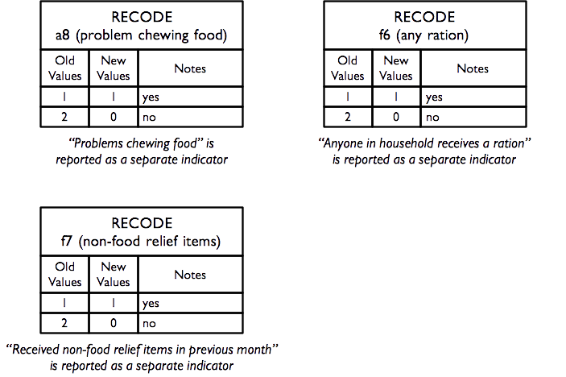
```

## A note on data management and data analysis

This section has described how RAM-OP data is used to create a broad set of indicators. If you do not want to use the standard RAM-OP software to do this then you can use this information to create data entry systems and data management scripts for your favoured database or statistical analysis software. See the sections on [**RAM-OP datasets**](#datasets) and [**RAM-OP questionnaire**](#questionnaire) for more compact information on variable names and codes that you may find helpful.

It is important to note that data analysis procedures need to account for the sample design. All major statistical analysis software can do this (details vary). There are two things to note:

* The RAM-OP sample is a two-stage sample. Subjects are sampled from a small number of primary sampling units (PSUs).
* The RAM-OP sample is **not** prior weighted. This means that you will need to provide per-PSU sampling weights. These are usually the populations of the PSU.

You will need to specify this sample design to your statistical analysis software. If you fail to do this then your analysis may produce estimates that place undue weight to observations from smaller communities with confidence intervals with lower than nominal coverage (i.e. they will be too narrow).

The standard RAM-OP software uses *blocked weighted bootstrap* estimation approach:

* **Blocked** : The block corresponds to the PSU or cluster.
* **Weighted** : The RAM-OP sampling procedure does not use population proportional sampling to weight the sample prior to data collection as is done with SMART type surveys. This means that a posterior weighting procedure is required. The standard RAM-OP software uses a “roulette wheel” algorithm to weight (i.e. by population) the selection probability of PSUs in bootstrap replicates.

A total of `m'` PSUs are sampled *with-replacement* from the survey dataset where `m'` is the number of PSUs in the survey sample. Individual records within each PSU are then sampled *with-replacement*. A total of n' records are sampled *with-replacement* from each of the selected PSUs where `n'` is the number of individual records in a selected PSU. The resulting collection of records replicates the original survey in terms of both sample design and sample size. A large number of replicate surveys are taken (the standard RAM-OP software uses $r = 399$ replicate surveys but this can be changed). The required statistic (e.g. the mean of an indicator value) is applied to each replicate survey. The reported estimate consists of the 50th (point estimate), 2.5th (lower 95% confidence limit), and the 97.5th (upper 95% confidence limit) percentiles of the distribution of the statistic observed across all replicate surveys. The blocked weighted bootstrap procedure is outlined in Figure \@ref(fig:indicators31).

The principal advantages of using a bootstrap estimator are:

* Bootstrap estimators work well with small sample sizes.
* The method is *non-parametric* and uses empirical rather than theoretical distributions. There are no assumptions of things like normality to worry about.
* The method allows estimation of the sampling distribution of almost any statistic using only simple computational methods.

The standard RAM-OP data analysis software is described in the section [**Standard RAM-OP software**](#software).

```{r indicators31, echo = FALSE, fig.cap = "The blocked weighted bootstrap used by the standard RAM-OP software", fig.align = "center", fig.pos = "H", fig.retina = 1}
knitr::include_graphics("figures/bbw.png")
```

