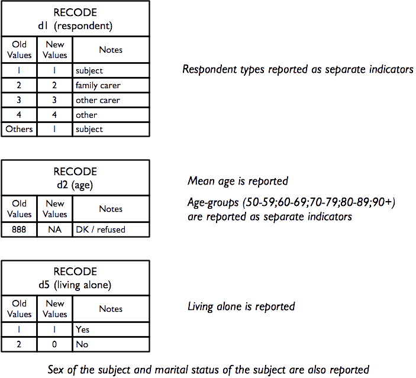
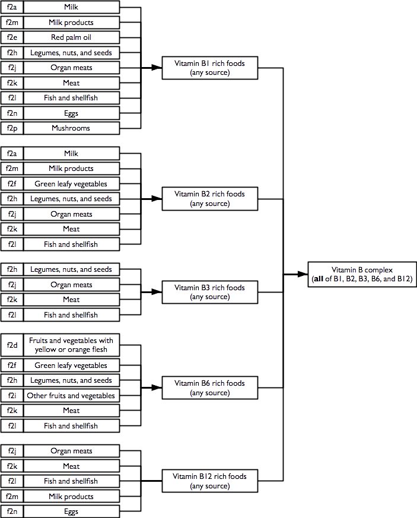
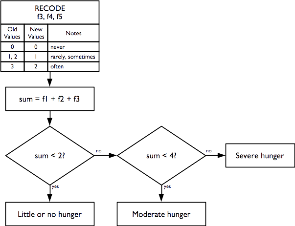

# Indicators {#indicators}

## The RAM-OP indicator set

RAM-OP surveys collect and report on data for a broad range of indicators relevant to older people.

These indicators cover the following dimensions:

* Demography and situation
* Food intake
* Severe food insecurity
* Disability
* Activities of daily living
* Mental health and well-being
* Dementia
* Health and health-seeking behaviour
* Sources of income
* Water, sanitation, and hygiene
* Anthropometry and screening coverage
* Visual impairment

Data for a small group of miscellaneous indicators are also collected and reported.

The RAM-OP indicator set has been designed on a modular basis. Each module is a set of indicators relating to a single dimension from the list given above and is collected using a dedicated set of questions and measurements. This means that the RAM-OP questionnaire also consists of a set of modules.

Whenever possible, RAM-OP uses standard and validated indicators and question sets.

Indicators are described below, showing the questionnaire components that are used to collect and record the data required, and flowcharts of the process used to derive indicators from the collected data. Standard symbols are used. For example:

```{r indicators01, echo = FALSE, fig.align = "center", fig.pos = "H", fig.retina = 1}
knitr::include_graphics("figures/indicators01.png")
```

A non-standard symbol is used to show **recode operations**. A recode operation shows changes that are made to data so that it can be used to derive indicators without having to show many decision nodes in the flowchart. They are also used to specify what should be done with missing or out-of-range values. For example:

```{r indicators02, echo = FALSE, fig.align = "center", fig.pos = "H", fig.retina = 1}
knitr::include_graphics("figures/indicators02.png")
```

### Demography and situation

The demography and situation indicators are used to describe the survey sample and are derived from this questionnaire component:


+----------+------------------------------------+------------------------------+---------------+
| d1       | Who is answering these questions?  | 1 = Subject                  | [__]          |
|          |                                    |                              |               |
|          |                                    | 2 = Family carer             |               |
|          |                                    |                              |               |
|          |                                    | 3 = Other carer              |               |
|          |                                    |                              |               |
|          |                                    | 4 = Other                    |               |
+----------+------------------------------------+------------------------------+---------------+
| d2       | How old are you (age in years)?    | 888 = DK / REFUSED           | [__][__][__]  |
+----------+------------------------------------+------------------------------+---------------+
| d3       | Sex                                | 1 = Male; 2 = Female         | [__]          |
+----------+------------------------------------+------------------------------+---------------+
| d4       | Marital status                     | 1 = Single (never married)   | [__]          |
|          |                                    |                              |               |
|          |                                    | 2 = Married                  |               |
|          |                                    |                              |               |
|          |                                    | 3 = Living together          |               |
|          |                                    |                              |               |
|          |                                    | 4 = Divorced                 |               |
|          |                                    |                              |               |
|          |                                    | 5 = Widowed                  |               |
|          |                                    |                              |               |
|          |                                    | 6 = Other                    |               |
+----------+------------------------------------+------------------------------+---------------+
| d5       | Do you live alone?                 | 1= Yes; 2 = No               | [__]          |
+----------+------------------------------------+------------------------------+---------------+

Each of the questions yields a separate indicator:

```{r indicators03, echo = FALSE, fig.align = "center", fig.pos = "H", fig.retina = 1}

```

### Food intake

Food-intake indicators are derived from this questionnaire component. This data can be queried to yield a large number of useful indicators.

+----------+--------------------------------------------------+------------------------------+---------------+
| f1       | How many meals did you eat since this time       | Number of meals              | [__]          |
|          | yesterday (Ask about breakfast, lunch, dinner,   |                              |               |
|          | and snacks)?                                     |                              |               |
+----------+--------------------------------------------------+------------------------------+---------------+
| f2       | Since this time yesterday did you eat any of the |                              |               |
|          | following foods ...                              |                              |               |
+----------+--------------------------------------------------+------------------------------+---------------+
| f2a      | Tinned, powdered or fresh milk?                  | 1 = Yes; 2 = No              | [__]          |
+----------+--------------------------------------------------+------------------------------+---------------+
| f2b      | Sweetened or flavoured water, “soda” drink,      | 1 = Yes; 2 = No              | [__]          |
|          | alcoholic drink, beer, tea or infusion, coffee,  |                              |               |
|          | soup, or broth?                                  |                              |               |
+----------+--------------------------------------------------+------------------------------+---------------+
| f2c      | Any food made from grain such as millet, wheat,  | 1 = Yes; 2 = No              | [__]          |      
|          | barley, sorghum, rice, maize, pasta, noodles,    |                              |               |
|          | bread, pizza, porridge?                          |                              |               |
+----------+--------------------------------------------------+------------------------------+---------------+
| f2d      | Any food made from fruits or vegetables that     | 1 = Yes; 2 = No              | [__]          |
|          | have yellow or orange flesh such as carrots,     |                              |               |
|          | pumpkin, red sweet potatoes, mangoes, and papaya?|                              |               |
+----------+--------------------------------------------------+------------------------------+---------------+
| f2e      | Any food made with red palm oil or red palm nuts?| 1 = Yes; 2 = No              | [__]          |
+----------+--------------------------------------------------+------------------------------+---------------+
| f2f      | Any dark green leafy vegetables such as cabbage, | 1 = Yes; 2 = No              | [__]          |
|          | broccoli, spinach, moringa leaves, cassava       |                              |               |
|          | leaves?                                          |                              |               |
+----------+--------------------------------------------------+------------------------------+---------------+
| f2g      | Any food made from roots or tubers such as white | 1 = Yes; 2 = No              | [__]          |
|          | potatoes, white yams, false banana, cassava,     |                              |               |
|          | manioc, onions, beets, turnips, and swedes?      |                              |               |
+----------+--------------------------------------------------+------------------------------+---------------+
| f2h      | Any food made from lentils, beans, peas,         | 1 = Yes; 2 = No              | [__]          |
|          | groundnuts, nuts, or seeds?                      |                              |               |
+----------+--------------------------------------------------+------------------------------+---------------+
| f2i      | Any other fruits or vegetables such as banana,   | 1 = Yes; 2 = No              | [__]          |
|          | plantain, avocado, cauliflower, coconut?         |                              |               |
+----------+--------------------------------------------------+------------------------------+---------------+
| f2j      | Liver, kidney, heart, black pudding, blood, or   | 1 = Yes; 2 = No              | [__]          |
|          | other organ meats?                               |                              |               |
+----------+--------------------------------------------------+------------------------------+---------------+
| f2k      | Any meat such as beef, pork, goat, lamb, mutton, | 1 = Yes; 2 = No              | [__]          |
|          | veal, chicken, camel, or bush meat?              |                              |               |
+----------+--------------------------------------------------+------------------------------+---------------+
| f2l      | Fresh or dried fish, shellfish, or seafood?      | 1 = Yes; 2 = No              | [__]          |
+----------+--------------------------------------------------+------------------------------+---------------+
| f2m      | Cheese, yoghurt, or other milk products?         | 1 = Yes; 2 = No              | [__]          |
+----------+--------------------------------------------------+------------------------------+---------------+
| f2n      | Eggs?                                            | 1 = Yes; 2 = No              | [__]          |
+----------+--------------------------------------------------+------------------------------+---------------+
| f2o      | Any food made with oil, fat, butter, or ghee?    | 1 = Yes; 2 = No              | [__]          |
+----------+--------------------------------------------------+------------------------------+---------------+
| f2p      | Any mushrooms or fungi?                          | 1 = Yes; 2 = No              | [__]          |
+----------+--------------------------------------------------+------------------------------+---------------+
| f2q      | Grubs, snails, insects?                          | 1 = Yes; 2 = No              | [__]          |
+----------+--------------------------------------------------+------------------------------+---------------+
| f2r      | Sugar, honey and foods made with sugar or honey  | 1 = Yes; 2 = No              | [__]          |
|          | such as sweets, candies, chocolate, cakes, and   |                              |               |
|          | biscuits?                                        |                              |               |
+----------+--------------------------------------------------+------------------------------+---------------+
| f2s      | Salt, pepper, herbs, spices, or sauces           | 1 = Yes; 2 = No              | [__]          |
|          | (hot sauce, soy sauce, ketchup)?                 |                              |               |
+----------+--------------------------------------------------+------------------------------+---------------+

There are three related sets of diet-related indicators:

* meal frequency
* food groups consumed / dietary diversity
* indicators of nutrient consumption.

The indicator hierarchy is:

```{r indicators04, echo = FALSE, fig.align = "center", fig.pos = "H", fig.retina = 1}

```

The data on the number of meals taken in the previous twenty-four hours forms a *meal frequency score*. 

Food intake data from each subject is combined into a *dietary diversity score*. The dietary diversity score is a crude measure of food security. The dietary diversity score ranges between zero (i.e. no food groups) and eleven (i.e. eleven food groups). Higher values of the dietary diversity sore are associated with better food security.

The meal frequency score and the dietary diversity score follow:

* Swindale A, Bilinsky P, *Household Dietary Diversity Score (HDDS) for measurement of household food access: Indicator guide*.,Washington DC, Food and Nutrition Technical Assistance (FANTA) Project, 2006

* Kennedy G, Ballard T, Dop MC, *Guidelines for Measuring Household and Individual Dietary Diversity*, Rome, Food and Agricultural Organization, 2010

The data on the types of food consumed in the previous twenty-four hours are analysed in order to determine the diet’s content of specific micronutrients that are important for older people. This also follows Swindale & Bilinsky (2006) and Kennedy et al (2010), and:

* World Health Organisation, *The management of nutrition in major emergencies*, Geneva, WHO, 2000

### Meal frequency

The meal frequency score indicator is the answer given to the first food intake question:

```{r indicators05, echo = FALSE, fig.align = "center", fig.pos = "H", fig.retina = 1}

```

Meal frequency is a crude measure of food security.

Higher values of meal frequency are associated with better food security.

### Food groups and dietary diversity

Questions relating to the consumption of individual food items / food types are combined to create food groups and the number of food groups consumed are counted to create a dietary diversity score:

```{r indicators06, echo = FALSE, fig.align = "center", fig.pos = "H", fig.retina = 1}

```

The consumption of the eleven individual food groups and the dietary diversity score are reported separately.

The dietary diversity score is a crude measure of food security. The dietary diversity score ranges between zero (no food groups) and eleven (eleven food groups). Higher values of the dietary diversity score are associated with better food security.

### Indicators of nutrient consumption

**Overview**

Questions and combinations of questions relating to the consumption of individual food items and food types can be used to determine whether the reported diet is likely to be provide sufficient nutrients of various types:

```{r indicators07, echo = FALSE, fig.align = "center", fig.pos = "H", fig.retina = 1}
knitr::include_graphics("figures/indicators07.png")
```

Each indicator is formed using logical “or” operations (i.e. the indicator is true if **any** of the constituent foods are consumed). For example, the indicator for the consumption of iron rich foods:

```{r indicators08, echo = FALSE, fig.align = "center", fig.pos = "H", fig.retina = 1}

```

requires the consumption of one or more of green leafy vegetables, organ meats, meat, or fish and shellfish. Consumption of **any** of these foods is sufficient to indicate that the survey subject consumes iron rich food.

#### Protein rich foods

Indicators of consumption of protein rich foods from animal sources, plant source, and any / all sources are calculated as:

```{r indicators09, echo = FALSE, fig.align = "center", fig.pos = "H", fig.retina = 1}
knitr::include_graphics("figures/indicators09.png")
```

#### Vitamin A rich foods

Indicators of consumption of vitamin A rich foods from animal sources, plant source, and any / all sources are calculated as:

```{r indicators10, echo = FALSE, fig.align = "center", fig.pos = "H", fig.retina = 1}
knitr::include_graphics("figures/indicators10.png")
```

#### Iron rich foods

An indicator of consumption of iron rich foods from any / all sources is calculated as:

```{r indicators11, echo = FALSE, fig.align = "center", fig.pos = "H", fig.retina = 1}
knitr::include_graphics("figures/indicators11.png")
```

#### Calcium rich foods

An indicator of consumption of calcium rich foods from any / all sources is calculated as:

```{r indicators12, echo = FALSE, fig.align = "center", fig.pos = "H", fig.retina = 1}
knitr::include_graphics("figures/indicators12.png")
```

#### Zinc rich foods

An indicator of consumption of zinc rich foods from any / all sources is calculated as:

```{r indicators13, echo = FALSE, fig.align = "center", fig.pos = "H", fig.retina = 1}
knitr::include_graphics("figures/indicators13.png")
```

#### Vitamin B rich foods

Indicators of consumption of vitamin B rich foods from any / all sources are calculated as:

```{r indicators14, echo = FALSE, fig.align = "center", fig.pos = "H", fig.retina = 1}

```

Note that the vitamin B complex indicator requires that at least one food from each of the B1, B2, B3, B6, and B12 rich food combinations is consumed.

### Severe food insecurity

An indicator of severe food insecurity (hunger) is derived from this questionnaire component:

+:----------------------------------------------------------------------------------------------------------:+
| **Hunger – Ration - Relief**                                                                               |
+------------------------------------------------------------------------------------------------------------+

+----------+--------------------------------------------------+------------------------------+---------------+
| f3       | In the past four weeks, how often was there ever | 0 = Never                    | [__]          |
|          | no food to eat of any kind in your home because  |                              |               |
|          | of lack of resources to get food?                | 1 = Rarely (1-2x)            |               |
|          |                                                  |                              |               |
|          |                                                  | 2 = Sometimes (3-10x)        |               |
|          |                                                  |                              |               |
|          |                                                  | 3 = Often (> 10x))           |               |
+----------+--------------------------------------------------+------------------------------+---------------+
| f4       | In the past four weeks, how often did you go to  | 0 = Never                    | [__]          |
|          | sleep at night hungry because there was not      |                              |               |
|          | enough food?                                     | 1 = Rarely (1-2x)            |               |
|          |                                                  |                              |               |
|          |                                                  | 2 = Sometimes (3-10x)        |               |
|          |                                                  |                              |               |
|          |                                                  | 3 = Often (> 10x))           |               |
+----------+--------------------------------------------------+------------------------------+---------------+
| f5       | In the past four weeks, how often did you go a   | 0 = Never                    | [__]          |
|          | whole day and night without eating anything at   |                              |               |
|          | all because there was not enough food?           | 1 = Rarely (1-2x)            |               |
|          |                                                  |                              |               |
|          |                                                  | 2 = Sometimes (3-10x)        |               |
|          |                                                  |                              |               |
|          |                                                  | 3 = Often (> 10x))           |               |
+----------+--------------------------------------------------+------------------------------+---------------+

and is calculated as:

```{r indicators15, echo = FALSE, fig.align = "center", fig.pos = "H", fig.retina = 1}

```

This indicator is the *Household Hunger Scale (HHS)* and is a simple, well-validated, and widely used indicator of severe food insecurity:

* Ballard T, Coates J, Swindale A, Deitchler M, *Household Hunger Scale: Indicator Definition and Measurement Guide*, Washington DC, FANTA-2 Bridge, FHI 360, 2011

* Ruel MT, Ballard TJ, Deitchler M, *Measuring and Tracking the Access Dimension of Food Security: Available Indicators and Recommendations for Future Investments*, Global Nutrition Report 2014: Technical Note 6, Washington DC, International Food Policy Research Institute, 2014


### Disability

Indicators of disability across six different domains are derived from this questionnaire component:


+:----------------------------------------------------------------------------------------------------------:+
| **Disability (Washington Group)**                                                                          |
+------------------------------------------------------------------------------------------------------------+

+----------+--------------------------------------------------+------------------------------+---------------+
| wg1      | Do you have difficulty seeing, even if wearing   | 0 = No difficulty            | [__]          |
|          | glasses?                                         |                              |               |
|          |                                                  | 1 = Some difficulty          |               |
|          |                                                  |                              |               |
|          |                                                  | 2 = A lot of difficulty      |               |
|          |                                                  |                              |               |
|          |                                                  | 3 = Cannot do at all         |               |
+----------+--------------------------------------------------+------------------------------+---------------+
| wg2      | Do you have difficulty hearing, even if using a  | 0 = No difficulty            | [__]          |
|          | hearing aid?                                     |                              |               |
|          |                                                  | 1 = Some difficulty          |               |
|          |                                                  |                              |               |
|          |                                                  | 2 = A lot of difficulty      |               |
|          |                                                  |                              |               |
|          |                                                  | 3 = Cannot do at all         |               |
+----------+--------------------------------------------------+------------------------------+---------------+
| wg3      | Do you have difficulty walking or climbing steps?| 0 = No difficulty            | [__]          |
|          |                                                  |                              |               |
|          |                                                  | 1 = Some difficulty          |               |
|          |                                                  |                              |               |
|          |                                                  | 2 = A lot of difficulty      |               |
|          |                                                  |                              |               |
|          |                                                  | 3 = Cannot do at all         |               |
+----------+--------------------------------------------------+------------------------------+---------------+
| wg4      | Do you have difficulty remembering or            | 0 = No difficulty            | [__]          |     
|          | concentrating?                                   |                              |               |
|          |                                                  | 1 = Some difficulty          |               |
|          |                                                  |                              |               |
|          |                                                  | 2 = A lot of difficulty      |               |
|          |                                                  |                              |               |
|          |                                                  | 3 = Cannot do at all         |               |
+----------+--------------------------------------------------+------------------------------+---------------+
| wg5      | Do you have difficulty with self-care such as    | 0 = No difficulty            | [__]          |
|          | washing all over or dressing?                    |                              |               |
|          |                                                  | 1 = Some difficulty          |               |
|          |                                                  |                              |               |
|          |                                                  | 2 = A lot of difficulty      |               |
|          |                                                  |                              |               |
|          |                                                  | 3 = Cannot do at all         |               |
+----------+--------------------------------------------------+------------------------------+---------------+
| wg6      | Using your usual (customary) language, do you    | 0 = No difficulty            | [__]          |
|          | have difficulty communicating, for example       |                              |               |
|          | understanding or being understood?               | 1 = Some difficulty          |               |
|          |                                                  |                              |               |
|          |                                                  | 2 = A lot of difficulty      |               |
|          |                                                  |                              |               |
|          |                                                  | 3 = Cannot do at all         |               |
+----------+--------------------------------------------------+------------------------------+---------------+


Individual disability indicators are reported for each domain (i.e. vision, hearing, mobility, remembering, self-care, and communication) of disability in the Washington Group’s short set of question designed to identify people with a disability in a census or survey format:

* http://www.washingtongroup-disability.com

* https://www.cdc.gov/nchs/washington_group/wg_documents.htm

Overall disability prevalence indicators are also reported.

Indicators of disability in each domain are calculated as:

```{r indicators16, echo = FALSE, fig.align = "center", fig.pos = "H", fig.retina = 1}
knitr::include_graphics("figures/indicators16.png")
```

Overall disability prevalence indicators are calculated as:

+----------+----------------------------------------------------------------------------------+
| `P0` = 1 | if no domain has `D1` = 1, else = 0 (no disability in any domain)                |
+----------+----------------------------------------------------------------------------------+
| `P1` = 1 | if at least one domain has `D1` = 1, else = 0                                    |
+----------+----------------------------------------------------------------------------------+
| `P2` = 1 | if at least one domain has `D2` = 1, else = 0                                    |
+----------+----------------------------------------------------------------------------------+
| `P3` = 1 | if at least one domain has `D3` = 1, else = 0                                    |
+----------+----------------------------------------------------------------------------------+
| `PM` = 1 | if at more than one domain has `D1` = 1, else = 0 (M stands for “Multiple”)      |
+----------+----------------------------------------------------------------------------------+

### Activities of daily living

Indicators of how well the subject copes with activities of daily living are derived from this questionnaire component:

+:----------------------------------------------------------------------------------------------------------:+
| **Activities of Daily Living**                                                                             |
+------------------------------------------------------------------------------------------------------------+

+----------+--------------------------------------------------+------------------------------+---------------+
| a1       | Do you need help with bathing more than one part | 1 = Yes; 2 = No              | [__]          |
|          | of your body or getting in or out of the tub or  |                              |               |
|          | shower?                                          |                              |               |
+----------+--------------------------------------------------+------------------------------+---------------+
| a2       | Do you need help getting dressed partially or    | 1 = Yes; 2 = No              | [__]          |
|          | completely (not including tying of shoes)?       |                              |               |
+----------+--------------------------------------------------+------------------------------+---------------+
| a3       | Do you need help going to the toilet or cleaning | 1 = Yes; 2 = No              | [__]          |
|          | yourself after using the toilet or do you use a  |                              |               |
|          | commode or bed-pan?                              |                              |               |
+----------+--------------------------------------------------+------------------------------+---------------+
| a4       | Do you need someone (i.e. not a walking aid) to  | 1 = Yes; 2 = No              | [__]          |
|          | help you move from a bed to a chair?             |                              |               |
+----------+--------------------------------------------------+------------------------------+---------------+
| a5       | Are you partially or totally incontinent of bowel| 1 = Yes; 2  = No             | [__]          |
|          | or bladder?                                      |                              |               |
+----------+--------------------------------------------------+------------------------------+---------------+
| a6       | Do you need partial or total help with eating?   | 1 = Yes; 2 = No              | [__]          |
+----------+--------------------------------------------------+------------------------------+---------------+
| a7       | Is someone taking care of you or helping you with| 1 = Yes; 2 = No              | [__]          |
|          | everyday activities such as shopping, cooking,   |                              |               |
|          | bathing and dressing?                            |                              |               |
+----------+--------------------------------------------------+------------------------------+---------------+

Individual *independence* indicators are reported for each dimension (i.e. bathing, dressing, toilet, mobility, continence, and eating) of daily living activities.

A composite indicator of the degree of *independence* (i.e. how well the subject can cope with activities of daily living) is also reported. This indicator is the *Katz Index of Independence in Activities of Daily Living* (or the *Katz Index of ADL* for short) and is a simple, well-validated, and widely used indicator of how well the subject can cope with activities of daily living:

* Katz S, Ford AB, Moskowitz RW, Jackson BA, Jaffe MW, *Studies of illness in the aged. The Index of ADL: A standardized measure of biological and psychosocial function*, JAMA, 185(12), 1963, pp. 914-9

* Katz S, Down TD, Cash HR, Grotz, RC, *Progress in the development of the index of ADL*, The Gerontologist, 10(1), 1970, pp. 20-30

* Katz S, *Assessing self-maintenance: Activities of daily living, mobility and instrumental activities of daily living*, JAGS, 31(12), 1983, pp. 721-726

The Katz Index of ADL ranges between zero (complete dependence) and six (independence).

The seventh question of this module, which is not part of the Katz Index of ADL, is reported separately and indicates whether the subject has someone to help them with activities of daily living:

+:----------------------------------------------------------------------------------------------------------:+
| **Activities of Daily Living**                                                                             |
+------------------------------------------------------------------------------------------------------------+

+----------+--------------------------------------------------+------------------------------+---------------+
| a7       | Is someone taking care of you or helping you with| 1 = Yes; 2 = No              | [__]          |
|          | everyday activities such as shopping, cooking,   |                              |               |
|          | bathing and dressing?                            |                              |               |
+----------+--------------------------------------------------+------------------------------+---------------+

t is not possible to know if the help available completely meets a subject's needs, but we can identify the proportion of subjects needing help with one or more activities of daily living who also report not having someone to help them:

```{r indicators17, echo = FALSE, fig.align = "center", fig.pos = "H", fig.retina = 1}
knitr::include_graphics("figures/indicators17.png")
```

This is an indicator of unmet need.

Indicators of how well the subject can cope with activities of daily living and probable unmet need are calculated as:

```{r indicators18, echo = FALSE, fig.align = "center", fig.pos = "H", fig.retina = 1}
knitr::include_graphics("figures/indicators18.png")
```

### Mental health and well-being
Indicators of mental health and well being are derived from this questionnaire component:

+:----------------------------------------------------------------------------------------------------------:+
| **Mental Health & Wellbeing**                                                                             |
+------------------------------------------------------------------------------------------------------------+

+----------+--------------------------------------------------+------------------------------+---------------+
| k6a      | About how often during the past four weeks did   | 1 = All of the time          | [__]          |
|          | you feel nervous – all of the time, most of the  |                              |               |
|          | time, some of the time, a little of the time, or | 2 = Most of the time         |               |
|          | none of the time?                                |                              |               |
|          |                                                  | 3 = Some of the time         |               |
|          |                                                  |                              |               |
|          |                                                  | 4 = A little                 |               |
|          |                                                  |                              |               |
|          |                                                  | 5 = None                     |               |
|          |                                                  |                              |               |
|          |                                                  | 6 = Don't know               |               |
|          |                                                  |                              |               |
|          |                                                  | 7 = Refused                  |               |
+----------+--------------------------------------------------+------------------------------+---------------+
| k6b      | During the past four weeks, about how often did  | 1 = All of the time          | [__]          |
|          | you feel hopeless – all of the time, most of the |                              |               |
|          | time, some of the time, a little of the time, or | 2 = Most of the time         |               |
|          | none of the time?                                |                              |               |
|          |                                                  | 3 = Some of the time         |               |
|          |                                                  |                              |               |
|          |                                                  | 4 = A little                 |               |
|          |                                                  |                              |               |
|          |                                                  | 5 = None                     |               |
|          |                                                  |                              |               |
|          |                                                  | 6 = Don't know               |               |
|          |                                                  |                              |               |
|          |                                                  | 7 = Refused                  |               |
+----------+--------------------------------------------------+------------------------------+---------------+
| k6c      | During the past four weeks, about how often did  | 1 = All of the time          | [__]          |
|          | you feel restless or fidgety – all of the time,  |                              |               |
|          | most of the time, some of the time, a little of  | 2 = Most of the time         |               |
|          | the time, or none of the time?                   |                              |               |
|          |                                                  | 3 = Some of the time         |               |
|          |                                                  |                              |               |
|          |                                                  | 4 = A little                 |               |
|          |                                                  |                              |               |
|          |                                                  | 5 = None                     |               |
|          |                                                  |                              |               |
|          |                                                  | 6 = Don't know               |               |
|          |                                                  |                              |               |
|          |                                                  | 7 = Refused                  |               |
+----------+--------------------------------------------------+------------------------------+---------------+
| k6d      | During the past four weeks, about how often did  | 1 = All of the time          | [__]          |
|          | you feel so depressed that nothing could cheer   |                              |               |
|          | you up – all of the time, most of the time, some | 2 = Most of the time         |               |
|          | of the time, a little of the time, or none of the|                              |               |
|          | time?                                            | 3 = Some of the time         |               |
|          |                                                  |                              |               |
|          |                                                  | 4 = A little                 |               |
|          |                                                  |                              |               |
|          |                                                  | 6 = Don't know               |               |
|          |                                                  |                              |               |
|          |                                                  | 7 = Refused                  |               |
+----------+--------------------------------------------------+------------------------------+---------------+
| k6e      | During the past four weeks, about how often did  | 1 = All of the time          | [__]          |
|          | you feel that everything was an effort – all of  |                              |               |
|          | the time, most of the time, some of the time, a  | 2 = Most of the time         |               |
|          | little of the time, or none of the time?         |                              |               |
|          |                                                  | 3 = Some of the time         |               |
|          |                                                  |                              |               |
|          |                                                  | 4 = A little                 |               |
|          |                                                  |                              |               |
|          |                                                  | 5 = None                     |               |
|          |                                                  |                              |               |
|          |                                                  | 6 = Don't know               |               |
|          |                                                  |                              |               |
|          |                                                  | 7 = Refused                  |               |
+----------+--------------------------------------------------+------------------------------+---------------+
| k6f      | During the past four weeks, about how often did  | 1 = All of the time          | [__]          |
|          | you feel worthless – all of the time, most of the|                              |               |
|          | time, some of the time, a little of the time, or | 2 = Most of the time         |               |
|          | none of the time?                                |                              |               |  
|          |                                                  | 3 = Some of the time         |               |
|          |                                                  |                              |               |
|          |                                                  | 5 = None                     |               |
|          |                                                  |                              |               |
|          |                                                  | 4 = A little                 |               |
|          |                                                  |                              |               |
|          |                                                  | 6 = Don't know               |               |
|          |                                                  |                              |               |
|          |                                                  | 7 = Refused                  |               |
+----------+--------------------------------------------------+------------------------------+---------------+

A score is calculated. This is the *Kessler K6 Psychological Distress Scale*. The score ranges from zero (indicating no psychological distress) to twenty-four (indicating severe psychological distress). A score of thirteen or more indicates serious psychological distress. The Kessler K6 Psychological Distress Scale is a widely recommended, widely used, accurate, reliable, and simple measure of psychological distress:

* Kessler RC, Andrews G, Colpe LJ, Hiripi E, Mroczek, DK, Normand SLT, et al, “Short screening scales to monitor population prevalences and trends in non-specific psychological distress”, *Psychological Medicine*, 32(6), 2002, pp. 959–976

* Kessler RC, Barker PR, Colpe LJ, Epstein JF, Gfroerer JC, Hiripi E, “Screening for Serious Mental Illness in the General Population”, *Archives of General Psychiatry*, 60(2), 2003, pp. 184-189

Indicators of mental health and well-being are calculated as:

```{r indicators19, echo = FALSE, fig.align = "center", fig.pos = "H", fig.retina = 1}
knitr::include_graphics("figures/indicators19.png")
```

### Dementia

An indicator of probable dementia is derived from this questionnaire component:

+:----------------------------------------------------------------------------------------------------------:+
| **Dementia Screen**                                                                                        |
+------------------------------------------------------------------------------------------------------------+

+------------------------------------------------------------------------------------------------------------+
| ds0      | This section can only be completed if the subject is answering for themselves.                  |
|          |                                                                                                 |
|          | If the respondent is not answering for themselves then record '8' as the answer for all         |
|          | questions below and continue with the interview. Write the reason why the subject is not        |
|          | answering for themselves in the OBSERVATIONS section at the end of the questionnaire.           |
|          |                                                                                                 |
|          |      Say :                                                                                      |
|          |                                                                                                 |
|          |           I am going to tell you three words.                                                   |
|          |                                                                                                 |
|          |           I would like you to repeat them after me.                                             |
|          |                                                                                                 |
|          |                “CHILD”                                                                          |
|          |                                                                                                 |
|          |                “HOUSE”                                                                          |
|          |                                                                                                 |
|          |                “ROAD”                                                                           |
|          |                                                                                                 |
|          |      Repeat the three words, up to a maximum of six (6) times, or until the person has          |
|          |      remembered them all correctly.                                                             |
|          |                                                                                                 |
|          |      Say :                                                                                      |
|          |                                                                                                 |
|          |           Try to remember these words. I will ask about them later.                             |
+------------------------------------------------------------------------------------------------------------+

+----------+--------------------------------------------------+------------------------------+---------------+
| ds1      | Point to your nose and ask :                     | 1 = Correct                  | [__]          |
|          |                                                  |                              |               |
|          |      What do we call this?                       | 2 = Incorrect                |               |
|          |                                                  |                              |               |
|          |                                                  | 8 = Not applicable           |               |
+----------+--------------------------------------------------+------------------------------+---------------+
| ds2      | What do you do with a hammer?                    | 1 = Correct                  | [__]          |      
|          |                                                  |                              |               |
|          |      Accept answers such as :                    | 2 = Incorrect                |               |
|          |                                                  |                              |               |
|          |          * Drive a nail into something           | 8 = Not applicable           |               |
|          |          * Straighten metal                      |                              |               |
|          |          * Hit a wedge or something else         |                              |               |
|          |          * Use with a chisel                     |                              |               |
+----------+--------------------------------------------------+------------------------------+---------------+
| ds3      | What day of the week is it?                      | 1 = Correct                  | [__]          |
|          |                                                  |                              |               |
|          |                                                  | 2 = Incorrect                |               |
|          |                                                  |                              |               |
|          |                                                  | 8 = Not applicable           |               |
+----------+--------------------------------------------------+------------------------------+---------------+
| ds4      | What is the season?                              | 1 = Correct                  | [__]          |
|          |                                                  |                              |               |
|          |                                                  | 2 = Incorrect                |               |
|          |                                                  |                              |               |
|          |                                                  | 8 = Not applicable           |               |
+----------+--------------------------------------------------+------------------------------+---------------+
| ds5      | Say:                                             | 1 = Correct                  | [__]          |
|          |      Please point first to the window and then   |                              |               |
|          |      to the door.                                | 2 = Incorrect                |               |
|          |                                                  |                              |               |
|          |                                                  | 8 = Not applicable           |               |
+----------+--------------------------------------------------+------------------------------+---------------+
| ds6      | Do you remember the three words I asked you to   |                              |               |
|          | remember a few minutes ago?                      |                              |               |
+----------+--------------------------------------------------+------------------------------+---------------+
| ds6a     | CHILD                                            | 1 = Correct                  | [__]          |
|          |                                                  |                              |               |
|          |                                                  | 2 = Incorrect                |               |
|          |                                                  |                              |               |
|          |                                                  | 8 = Not applicable           |               |
+----------+--------------------------------------------------+------------------------------+---------------+
| ds6b     | HOUSE                                            | 1 = Correct                  | [__]          |
|          |                                                  |                              |               |
|          |                                                  | 2 = Incorrect                |               |
|          |                                                  |                              |               |
|          |                                                  | 8 = Not applicable           |               |
+----------+--------------------------------------------------+------------------------------+---------------+
| ds6c     | ROAD                                             | 1 = Correct                  |               |
|          |                                                  |                              |               |
|          |                                                  | 2 = Incorrect                |               |
|          |                                                  |                              |               |
|          |                                                  | 8 = Not applicable           |               |
+----------+--------------------------------------------------+------------------------------+---------------+

The indicator of *probable* dementia is calculated as:

```{r indicators20, echo = FALSE, fig.align = "center", fig.pos = "H", fig.retina = 1}
knitr::include_graphics("figures/indicators20.png")
```

This indicator is derived from the Community Screening Instrument for Dementia (CSID) developed by the 10/66 Dementia Research Group. This is a simple, validated, and widely used indicator of probable dementia:

Prince M, et al, “A brief dementia screener suitable for use by non-specialists in resource poor settings - The cross-cultural derivation and validation of the brief Community Screening Instrument for Dementia”, *International Journal of Geriatric Psychiatry*, 26(9), 2011, pp. 899–907

### Health and health-seeking behaviour

Indicators of health and health-seeking behaviour for chronic and acute conditions are derived from this questionnaire component:

+:----------------------------------------------------------------------------------------------------------:+
| **Health Seeking & Healthcare**                                                                            |
+------------------------------------------------------------------------------------------------------------+

+----------+--------------------------------------------------+------------------------------+---------------+
| h1       | Do you suffer from a long term disease that      | 1 = Yes; 2 = No              | [__]          |
|          | requires you to take regular medication?         |                              |               |
+----------+--------------------------------------------------+------------------------------+---------------+
| ??       | If ***NO*** jump to question `h4` (below)        |                              |               |
+----------+--------------------------------------------------+------------------------------+---------------+
| h2       | Do you take drugs regularly for this?            | 1 = Yes; 2 = No              | [__]          |
+----------+--------------------------------------------------+------------------------------+---------------+
| ??       | If ***YES*** jump to question h4                 |                              |               |
+----------+--------------------------------------------------+------------------------------+---------------+
| h3       | Why not?                                         | 1 = No drugs available       | [__]          |
|          |                                                  |                              |               |
|          |      Prompt for the main reason                  | 2 = Too expensive / no money |               |
|          |                                                  |                              |               |
|          |      Record main reason only                     | 3 = Too old to look for care |               |
|          |                                                  |                              |               |
|          |                                                  | 4 = Use traditional medicine |               |
|          |                                                  |                              |               |
|          |                                                  | 5 = Drugs don't help         |               |
|          |                                                  |                              |               |
|          |                                                  | 6 = No-one to help me        |               |
|          |                                                  |                              |               |
|          |                                                  | 7 = No need                  |               |
|          |                                                  |                              |               |
|          |                                                  | 8 = Other                    |               |
|          |                                                  |                              |               |
|          |                                                  | 9 = No reason given          |               |
+----------+--------------------------------------------------+------------------------------+---------------+
| h4       | Have you been ill in the past two weeks?         |                              |               |
+----------+--------------------------------------------------+------------------------------+---------------+
| ??       | If ***NO*** jump to question `m1` (below)        |                              |               |
+----------+--------------------------------------------------+------------------------------+---------------+
| h5       | Did you go to the pharmacy, dispensary, health   | 1 = Yes; 2 = No              | [__]          |
|          | centre, health post, clinic, or hospital?        |                              |               |
+----------+--------------------------------------------------+------------------------------+---------------+
| ??       | If ***YES*** then jump to question `m1` (below)  |                              |               |
| h6       | Why not?                                         | 1 = No drugs available       | [__]          |
|          |                                                  |                              |               |
|          |      Prompt for the main reason                  | 2 = Too expensive / no money |               |
|          |                                                  |                              |               |
|          |      Record main reason only                     | 3 = Too old to look for care |               |
|          |                                                  |                              |               |
|          |                                                  | 4 = Use traditional medicine |               |
|          |                                                  |                              |               |
|          |                                                  | 5 = Drugs don't help         |               |
|          |                                                  |                              |               |
|          |                                                  | 6 = No-one to help me        |               |
|          |                                                  |                              |               |
|          |                                                  | 7 = No need                  |               |
|          |                                                  |                              |               |
|          |                                                  | 8 = Other                    |               |
|          |                                                  |                              |               |
|          |                                                  | 9 = No reason given          |               |
+----------+--------------------------------------------------+------------------------------+---------------+

Indicators of health and health-seeking behaviour for chronic conditions are calculated as:

```{r indicators21, echo = FALSE, fig.align = "center", fig.pos = "H", fig.retina = 1}
knitr::include_graphics("figures/indicators21.png")
```

Indicators of health and health-seeking behaviour for acute conditions are calculated as:

```{r indicators22, echo = FALSE, fig.align = "center", fig.pos = "H", fig.retina = 1}

```

### Sources of income

Indicators related to sources of income are derived from this questionnaire component:

+:----------------------------------------------------------------------------------------------------------:+
| **Income**                                                                                                 |
+------------------------------------------------------------------------------------------------------------+

+----------+--------------------------------------------------+------------------------------+---------------+
| m1       | Do you have a personal source of income or money?| 1 = Yes; 2 = No              | |__|          |
+----------+--------------------------------------------------+------------------------------+---------------+
| ??       | Continue to question m2 even if the subject      |                              |               |
|          | reports having no personal income...             |                              |               |
+----------+--------------------------------------------------+------------------------------+---------------+
| m2       | Where does your income or money come from?       |                              |               |
|          | (prompt “Anything else?”)                        |                              |               |
+----------+--------------------------------------------------+------------------------------+---------------+
| m2a      | Agriculture, livestock, or fishing               | 1 = Yes; 2 = No              | [__]          |
+----------+--------------------------------------------------+------------------------------+---------------+
| m2b      | Wages or salary                                  | 1 = Yes; 2 = No              | [__]          |
+----------+--------------------------------------------------+------------------------------+---------------+
| m2c      | Sale of charcoal, bricks, firewood, poles, etc.  | 1 = Yes; 2 = No              | [__]          |
+----------+--------------------------------------------------+------------------------------+---------------+
| m2d      | Trading (e.g. market, shop)                      | 1 = Yes; 2 = No              | [__]          |
+----------+--------------------------------------------------+------------------------------+---------------+
| m2e      | Private pension, investments, interest, rents,   | 1 = Yes; 2 = No              | [__]          |
|          | etc.                                             |                              |               |
+----------+--------------------------------------------------+------------------------------+---------------+
| m2f      | Spending savings                                 |                              |               |
|          | Sale of household goods, personal goods, or      | 1 = Yes; 2 = No              | [__]          |
|          | jewellery                                        |                              |               |
|          | Sale of livestock, land, or other assets         |                              |               |
+----------+--------------------------------------------------+------------------------------+---------------+
| m2g      | Aid, gifts, charity (e.g. from church, mosque,   | 1 = Yes; 2 = No              | [__]          |
|          | temple), begging, borrowing, or sale of food aid |                              |               |
|          | or relief items                                  |                              |               |
+----------+--------------------------------------------------+------------------------------+---------------+
| m2h      | Cash transfer (NGO, UNO, government)             | 1 = Yes; 2 = No              | [__]          |
|          | State pension, social security, benefits, welfare|                              |               |
|          | program                                          |                              |               |
+----------+--------------------------------------------------+------------------------------+---------------+
| m2i      | Other                                            | 1 = Yes; 2 = No              |               |
+----------+--------------------------------------------------+------------------------------+---------------+

and are calculated as:

```{r indicators23, echo = FALSE, fig.align = "center", fig.pos = "H", fig.retina = 1}
knitr::include_graphics("figures/indicators23.png")
```

The grouped income sources (i.e. `m2a`, `m2b`, etc.) and individual income sources may vary between settings. The questionnaire component shown above has proved suitable for use in Ethiopia, South Sudan, and Tanzania.

### Water, sanitation, and hygiene
Indicators relating to water, sanitation, and hygiene (WASH) are derived from this questionnaire component:

+:----------------------------------------------------------------------------------------------------------:+
| **Water, Sanitation, Hygiene**                                                                             |
+------------------------------------------------------------------------------------------------------------+

+----------+--------------------------------------------------+------------------------------+---------------+
| w1       | What is your main source of drinking water?      |                              |               |
+----------+--------------------------------------------------+------------------------------+---------------+
|          |      Piped water into dwelling                   |                              |               |
|          |                                                  |                              |               |
|          |      Piped water into compound                   |                              |               |
|          |                                                  |                              |               |
|          |      Public tap / Standpipe                      |                              |               |
|          |                                                  |                              |               |
|          |      Tube-well / Borehole                        |                1            | [__]          |     
|          |                                                  |                              |               |
|          |      Protected dug well                          |                              |               |
|          |                                                  |                              |               |
|          |      Protected spring                            |                              |               |
|          |                                                  |                              |               |
|          |      Rainwater collection system                 |                              |               |
|          |                                                  |                              |               |
|          |      Bottled water / sachet water                |                              |               |
+----------+--------------------------------------------------+------------------------------+---------------+
|          |      Unprotected dug well                        |                              |               |
|          |                                                  |                              |               |
|          |      Unprotected spring                          |                              |               |
|          |                                                  |                              |               |
|          |      Cart with small tank or drum                |                              |               |
|          |                                                  |                              |               |
|          |      Tanker-truck                                |                2             | [__]          |
|          |                                                  |                              |               |
|          |      River, stream, dam, lake, pond, or puddle   |                              |               |
|          |                                                  |                              |               |
|          |      Canal or irrigation channel                 |                              |               |
|          |                                                  |                              |               |
|          |      Other                                       |                              |               |
+----------+--------------------------------------------------+------------------------------+---------------+
| w2       | What do you usually do to the water to make it   |                              |               |
|          | safer to drink?                                  |                              |               |
+----------+--------------------------------------------------+------------------------------+---------------+
|          |      Boil                                        |                              |               |
|          |                                                  |                              |               |
|          |      Add bleach / chlorine tablet                |                              |               |
|          |                                                  |                1             | [__]          |
|          |      Use a water filter (gravel / sand / ceramic)|                              |               |
|          |                                                  |                              |               |
|          |      Solar disinfection                          |                              |               |
+----------+--------------------------------------------------+------------------------------+---------------+
|          |      Strain it through a cloth only              |                              |               |
|          |                                                  |                              |               |
|          |      Let it stand and settle only                |                              |               |
|          |                                                  |                              |               |
|          |      Nothing                                     |               2              | [__]          |
|          |                                                  |                              |               |
|          |      Other                                       |                              |               |
|          |                                                  |                              |               |
|          |      Don't know                                  |                              |               |
+----------+--------------------------------------------------+------------------------------+---------------+
| w3       | What kind of toilet facility do members of your  |                              |               |
|          | household usually use?                           |                              |               |
+----------+--------------------------------------------------+------------------------------+---------------+
|          |      Flush or pour flush to:                     |                              |               |
|          |         Piped sewer system                       |
|          |         Septic tank                              |
|          |         Pit latrine                              |
|          |         Don't know                               |
|          |      VIP latrine                                 | 
|          |      Pit latrine with slab                       |
|          |      Composting toilet	                          |
+----------+--------------------------------------------------+------------------------------+---------------+
|          |      Flush or pour flush to:                     | 1 = Yes
|          |         Elsewhere (anywhere not specified above) |
|          |      Pit latrine without slab                    |
|          |      Bucket                                      |
|          |      Hanging latrine                             |
|          |      Bush or field                               |
|          |      No facilities                               |
| w4       | Do you share this toilet facility with other     |
|          | households?                                      |

2 = No
3 = NA (no facility)
|__|

Indicators are calculated following:
WHO / UNICEF, Core Questions on Drinking-water and Sanitation for Household Surveys, Geneva, WHO / UNICEF, 2006