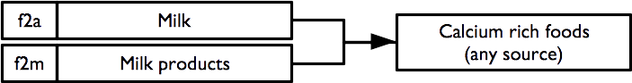

# Indicators {#indicators}

## The RAM-OP indicator set

RAM-OP surveys collect and report on data for a broad range of indicators relevant to older people.

These indicators cover the following dimensions:

* Demography and situation
* Food intake
* Severe food insecurity
* Disability
* Activities of daily living
* Mental health and well-being
* Dementia
* Health and health-seeking behaviour
* Sources of income
* Water, sanitation, and hygiene
* Anthropometry and screening coverage
* Visual impairment

Data for a small group of miscellaneous indicators are also collected and reported.

The RAM-OP indicator set has been designed on a modular basis. Each module is a set of indicators relating to a single dimension from the list given above and is collected using a dedicated set of questions and measurements. This means that the RAM-OP questionnaire also consists of a set of modules.

Whenever possible, RAM-OP uses standard and validated indicators and question sets.

Indicators are described below, showing the questionnaire components that are used to collect and record the data required, and flowcharts of the process used to derive indicators from the collected data. Standard symbols are used. For example:

```{r indicators01, echo = FALSE, fig.align = "center", fig.pos = "H", fig.retina = 1}
knitr::include_graphics("figures/indicators01.png")
```

A non-standard symbol is used to show **recode operations**. A recode operation shows changes that are made to data so that it can be used to derive indicators without having to show many decision nodes in the flowchart. They are also used to specify what should be done with missing or out-of-range values. For example:

```{r indicators02, echo = FALSE, fig.align = "center", fig.pos = "H", fig.retina = 1}

```

### Demography and situation

The demography and situation indicators are used to describe the survey sample and are derived from this questionnaire component:


+----------+------------------------------------+------------------------------+---------------+
| d1       | Who is answering these questions?  | 1 = Subject                  | [__]          |
|          |                                    |                              |               |
|          |                                    | 2 = Family carer             |               |
|          |                                    |                              |               |
|          |                                    | 3 = Other carer              |               |
|          |                                    |                              |               |
|          |                                    | 4 = Other                    |               |
+----------+------------------------------------+------------------------------+---------------+
| d2       | How old are you (age in years)?    | 888 = DK / REFUSED           | [__][__][__]  |
+----------+------------------------------------+------------------------------+---------------+
| d3       | Sex                                | 1 = Male; 2 = Female         | [__]          |
+----------+------------------------------------+------------------------------+---------------+
| d4       | Marital status                     | 1 = Single (never married)   | [__]          |
|          |                                    |                              |               |
|          |                                    | 2 = Married                  |               |
|          |                                    |                              |               |
|          |                                    | 3 = Living together          |               |
|          |                                    |                              |               |
|          |                                    | 4 = Divorced                 |               |
|          |                                    |                              |               |
|          |                                    | 5 = Widowed                  |               |
|          |                                    |                              |               |
|          |                                    | 6 = Other                    |               |
+----------+------------------------------------+------------------------------+---------------+
| d5       | Do you live alone?                 | 1= Yes; 2 = No               | [__]          |
+----------+------------------------------------+------------------------------+---------------+

Each of the questions yields a separate indicator:

```{r indicators03, echo = FALSE, fig.align = "center", fig.pos = "H", fig.retina = 1}
knitr::include_graphics("figures/indicators03.png")
```

### Food intake

Food-intake indicators are derived from this questionnaire component. This data can be queried to yield a large number of useful indicators.

+----------+--------------------------------------------------+------------------------------+---------------+
| f1       | How many meals did you eat since this time       | Number of meals              | [__]          |
|          | yesterday (Ask about breakfast, lunch, dinner,   |                              |               |
|          | and snacks)?                                     |                              |               |
+----------+--------------------------------------------------+------------------------------+---------------+
| f2       | Since this time yesterday did you eat any of the |                              |               |
|          | following foods ...                              |                              |               |
+----------+--------------------------------------------------+------------------------------+---------------+
| f2a      | Tinned, powdered or fresh milk?                  | 1 = Yes; 2 = No              | [__]          |
+----------+--------------------------------------------------+------------------------------+---------------+
| f2b      | Sweetened or flavoured water, “soda” drink,      | 1 = Yes; 2 = No              | [__]          |
|          | alcoholic drink, beer, tea or infusion, coffee,  |                              |               |
|          | soup, or broth?                                  |                              |               |
+----------+--------------------------------------------------+------------------------------+---------------+
| f2c      | Any food made from grain such as millet, wheat,  | 1 = Yes; 2 = No              | [__]          |      
|          | barley, sorghum, rice, maize, pasta, noodles,    |                              |               |
|          | bread, pizza, porridge?                          |                              |               |
+----------+--------------------------------------------------+------------------------------+---------------+
| f2d      | Any food made from fruits or vegetables that     | 1 = Yes; 2 = No              | [__]          |
|          | have yellow or orange flesh such as carrots,     |                              |               |
|          | pumpkin, red sweet potatoes, mangoes, and papaya?|                              |               |
+----------+--------------------------------------------------+------------------------------+---------------+
| f2e      | Any food made with red palm oil or red palm nuts?| 1 = Yes; 2 = No              | [__]          |
+----------+--------------------------------------------------+------------------------------+---------------+
| f2f      | Any dark green leafy vegetables such as cabbage, | 1 = Yes; 2 = No              | [__]          |
|          | broccoli, spinach, moringa leaves, cassava       |                              |               |
|          | leaves?                                          |                              |               |
+----------+--------------------------------------------------+------------------------------+---------------+
| f2g      | Any food made from roots or tubers such as white | 1 = Yes; 2 = No              | [__]          |
|          | potatoes, white yams, false banana, cassava,     |                              |               |
|          | manioc, onions, beets, turnips, and swedes?      |                              |               |
+----------+--------------------------------------------------+------------------------------+---------------+
| f2h      | Any food made from lentils, beans, peas,         | 1 = Yes; 2 = No              | [__]          |
|          | groundnuts, nuts, or seeds?                      |                              |               |
+----------+--------------------------------------------------+------------------------------+---------------+
| f2i      | Any other fruits or vegetables such as banana,   | 1 = Yes; 2 = No              | [__]          |
|          | plantain, avocado, cauliflower, coconut?         |                              |               |
+----------+--------------------------------------------------+------------------------------+---------------+
| f2j      | Liver, kidney, heart, black pudding, blood, or   | 1 = Yes; 2 = No              | [__]          |
|          | other organ meats?                               |                              |               |
+----------+--------------------------------------------------+------------------------------+---------------+
| f2k      | Any meat such as beef, pork, goat, lamb, mutton, | 1 = Yes; 2 = No              | [__]          |
|          | veal, chicken, camel, or bush meat?              |                              |               |
+----------+--------------------------------------------------+------------------------------+---------------+
| f2l      | Fresh or dried fish, shellfish, or seafood?      | 1 = Yes; 2 = No              | [__]          |
+----------+--------------------------------------------------+------------------------------+---------------+
| f2m      | Cheese, yoghurt, or other milk products?         | 1 = Yes; 2 = No              | [__]          |
+----------+--------------------------------------------------+------------------------------+---------------+
| f2n      | Eggs?                                            | 1 = Yes; 2 = No              | [__]          |
+----------+--------------------------------------------------+------------------------------+---------------+
| f2o      | Any food made with oil, fat, butter, or ghee?    | 1 = Yes; 2 = No              | [__]          |
+----------+--------------------------------------------------+------------------------------+---------------+
| f2p      | Any mushrooms or fungi?                          | 1 = Yes; 2 = No              | [__]          |
+----------+--------------------------------------------------+------------------------------+---------------+
| f2q      | Grubs, snails, insects?                          | 1 = Yes; 2 = No              | [__]          |
+----------+--------------------------------------------------+------------------------------+---------------+
| f2r      | Sugar, honey and foods made with sugar or honey  | 1 = Yes; 2 = No              | [__]          |
|          | such as sweets, candies, chocolate, cakes, and   |                              |               |
|          | biscuits?                                        |                              |               |
+----------+--------------------------------------------------+------------------------------+---------------+
| f2s      | Salt, pepper, herbs, spices, or sauces           | 1 = Yes; 2 = No              | [__]          |
|          | (hot sauce, soy sauce, ketchup)?                 |                              |               |
+----------+--------------------------------------------------+------------------------------+---------------+

There are three related sets of diet-related indicators:

* meal frequency
* food groups consumed / dietary diversity
* indicators of nutrient consumption.

The indicator hierarchy is:

```{r indicators04, echo = FALSE, fig.align = "center", fig.pos = "H", fig.retina = 1}
knitr::include_graphics("figures/indicators04.png")
```

The data on the number of meals taken in the previous twenty-four hours forms a *meal frequency score*. 

Food intake data from each subject is combined into a *dietary diversity score*. The dietary diversity score is a crude measure of food security. The dietary diversity score ranges between zero (i.e. no food groups) and eleven (i.e. eleven food groups). Higher values of the dietary diversity sore are associated with better food security.

The meal frequency score and the dietary diversity score follow:

* Swindale A, Bilinsky P, *Household Dietary Diversity Score (HDDS) for measurement of household food access: Indicator guide*.,Washington DC, Food and Nutrition Technical Assistance (FANTA) Project, 2006

* Kennedy G, Ballard T, Dop MC, *Guidelines for Measuring Household and Individual Dietary Diversity*, Rome, Food and Agricultural Organization, 2010

The data on the types of food consumed in the previous twenty-four hours are analysed in order to determine the diet’s content of specific micronutrients that are important for older people. This also follows Swindale & Bilinsky (2006) and Kennedy et al (2010), and:

* World Health Organisation, *The management of nutrition in major emergencies*, Geneva, WHO, 2000

### Meal frequency

The meal frequency score indicator is the answer given to the first food intake question:

```{r indicators05, echo = FALSE, fig.align = "center", fig.pos = "H", fig.retina = 1}
knitr::include_graphics("figures/indicators05.png")
```

Meal frequency is a crude measure of food security.

Higher values of meal frequency are associated with better food security.

### Food groups and dietary diversity

Questions relating to the consumption of individual food items / food types are combined to create food groups and the number of food groups consumed are counted to create a dietary diversity score:

```{r indicators06, echo = FALSE, fig.align = "center", fig.pos = "H", fig.retina = 1}
knitr::include_graphics("figures/indicators06.png")
```

The consumption of the eleven individual food groups and the dietary diversity score are reported separately.

The dietary diversity score is a crude measure of food security. The dietary diversity score ranges between zero (no food groups) and eleven (eleven food groups). Higher values of the dietary diversity score are associated with better food security.

### Indicators of nutrient consumption

**Overview**

Questions and combinations of questions relating to the consumption of individual food items and food types can be used to determine whether the reported diet is likely to be provide sufficient nutrients of various types:

```{r indicators07, echo = FALSE, fig.align = "center", fig.pos = "H", fig.retina = 1}
knitr::include_graphics("figures/indicators07.png")
```

Each indicator is formed using logical “or” operations (i.e. the indicator is true if **any** of the constituent foods are consumed). For example, the indicator for the consumption of iron rich foods:

```{r indicators08, echo = FALSE, fig.align = "center", fig.pos = "H", fig.retina = 1}
knitr::include_graphics("figures/indicators08.png")
```

requires the consumption of one or more of green leafy vegetables, organ meats, meat, or fish and shellfish. Consumption of **any** of these foods is sufficient to indicate that the survey subject consumes iron rich food.

#### Protein rich foods

Indicators of consumption of protein rich foods from animal sources, plant source, and any / all sources are calculated as:

```{r indicators09, echo = FALSE, fig.align = "center", fig.pos = "H", fig.retina = 1}

```

#### Vitamin A rich foods

Indicators of consumption of vitamin A rich foods from animal sources, plant source, and any / all sources are calculated as:

```{r indicators10, echo = FALSE, fig.align = "center", fig.pos = "H", fig.retina = 1}
knitr::include_graphics("figures/indicators10.png")
```

#### Iron rich foods

An indicator of consumption of iron rich foods from any / all sources is calculated as:

```{r indicators11, echo = FALSE, fig.align = "center", fig.pos = "H", fig.retina = 1}
knitr::include_graphics("figures/indicators11.png")
```

#### Calcium rich foods

An indicator of consumption of calcium rich foods from any / all sources is calculated as:

```{r indicators12, echo = FALSE, fig.align = "center", fig.pos = "H", fig.retina = 1}

```

#### Zinc rich foods

An indicator of consumption of zinc rich foods from any / all sources is calculated as:

```{r indicators13, echo = FALSE, fig.align = "center", fig.pos = "H", fig.retina = 1}
knitr::include_graphics("figures/indicators13.png")
```

#### Vitamin B rich foods

Indicators of consumption of vitamin B rich foods from any / all sources are calculated as:

```{r indicators14, echo = FALSE, fig.align = "center", fig.pos = "H", fig.retina = 1}
knitr::include_graphics("figures/indicators14.png")
```

Note that the vitamin B complex indicator requires that at least one food from each of the B1, B2, B3, B6, and B12 rich food combinations is consumed.

### Severe food insecurity

An indicator of severe food insecurity (hunger) is derived from this questionnaire component:

+:----------------------------------------------------------------------------------------------------------:+
| **Hunger – Ration - Relief**                                                                               |
+------------------------------------------------------------------------------------------------------------+

+----------+--------------------------------------------------+------------------------------+---------------+
| f3       | In the past four weeks, how often was there ever | 0 = Never                    | [__]          |
|          | no food to eat of any kind in your home because  |                              |               |
|          | of lack of resources to get food?                | 1 = Rarely (1-2x)            |               |
|          |                                                  |                              |               |
|          |                                                  | 2 = Sometimes (3-10x)        |               |
|          |                                                  |                              |               |
|          |                                                  | 3 = Often (> 10x))           |               |
+----------+--------------------------------------------------+------------------------------+---------------+
| f4       | In the past four weeks, how often did you go to  | 0 = Never                    | [__]          |
|          | sleep at night hungry because there was not      |                              |               |
|          | enough food?                                     | 1 = Rarely (1-2x)            |               |
|          |                                                  |                              |               |
|          |                                                  | 2 = Sometimes (3-10x)        |               |
|          |                                                  |                              |               |
|          |                                                  | 3 = Often (> 10x))           |               |
+----------+--------------------------------------------------+------------------------------+---------------+
| f5       | In the past four weeks, how often did you go a   | 0 = Never                    | [__]          |
|          | whole day and night without eating anything at   |                              |               |
|          | all because there was not enough food?           | 1 = Rarely (1-2x)            |               |
|          |                                                  |                              |               |
|          |                                                  | 2 = Sometimes (3-10x)        |               |
|          |                                                  |                              |               |
|          |                                                  | 3 = Often (> 10x))           |               |
+----------+--------------------------------------------------+------------------------------+---------------+

and is calculated as:

```{r indicators15, echo = FALSE, fig.align = "center", fig.pos = "H", fig.retina = 1}
knitr::include_graphics("figures/indicators15.png")
```

