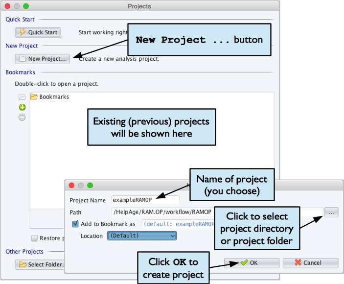
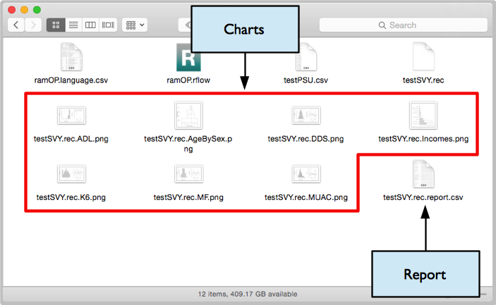
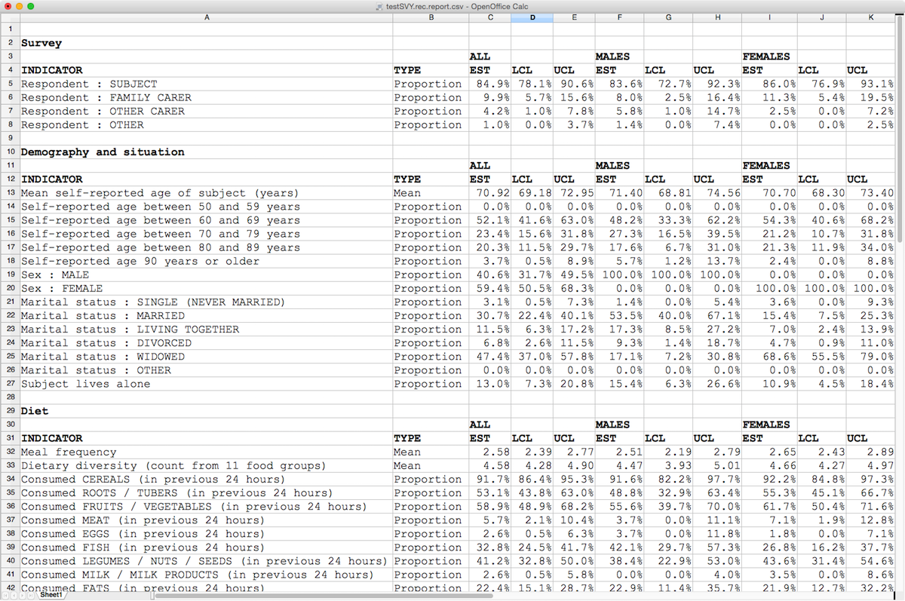

# RAM-OP Software {#software}

## Data entry

## Data analysis

This manual covers analysing your data using the **RAnalyticFlow** workflow. An **RAnalyticFlow** workflow may be thought of as an *“app”* that makes it easy to analyse your survey data.

To use the **RAnalyticFlow** workflow you must install:

* **The *R Language for Data-Analysis and Graphics* (R)** : This is the *“engine”* which does all the
work of analysing your data. You can get the R installation program from: [http://cran.r-project.org](http://cran.r-project.org). Following are links to download operating sofware-specific versions of R:

   * [Download R for Linux](https://cran.r-project.org/bin/linux/)

   * [Download R for (Mac) OS X](https://cran.r-project.org/bin/macosx/)

   * [Download R for Windowx](https://cran.r-project.org/bin/windows/)

* **R packages** (libraries of functions needed to work with the **RAnalyticFlow** workflow) : You can install these from within **R** using the Package Installer function within R. The libraries needed are:

+--------------------+---------------------------------------------------------+
| **Package**        | **Comments**                                            |
+====================+=========================================================+
| **rJava**          | Required: Used by **RAnalyticFlow**                     |
+--------------------+---------------------------------------------------------+
| **JavaGD**         | Required: Used by **RAnalyticFlow**                     |
+--------------------+---------------------------------------------------------+
| **codetools**      | Required: Used by **RAnalyticFlow**                     |
+--------------------+---------------------------------------------------------+
| **foreign**        | Required: Opens **EpiData** (REC) files                 |
+--------------------+---------------------------------------------------------+
| **car**            | Required: Used for PROBIT estimator                     |
+--------------------+---------------------------------------------------------+
| **ggplot2**        | Desirable: Provides many plotting functions             |
+--------------------+---------------------------------------------------------+
| **data.table**     | Desirable: Speeds up working with large dataset         |
+--------------------+---------------------------------------------------------+

The Package Installer function can be called in R using the following command:


```{r software, eval = FALSE}
install.packages(c("rJava", "JavaGD", "codetools", 
                   "foreign", "car", "ggplot2", "data.table"), 
                   repos = "https://cloud.r-project.org/")
```

The `repos` argument in the R command above specifies the CRAN mirror from which you to download the package/s you want to install. Here we specify the cloud-based mirror for CRAN provided by RStudio. If unspecified, the installiation process will prompt you to select a mirror from which to download packages from. If you already know the URL of the CRAN mirror you want to use, specify this in the `repos` argument. 

Note that **RAnalyticFlow** may require you to have **Java** installed. Check the instructions on the **RAnalyticFlow** [download page](http://r.analyticflow.com/en/download/) and on this [starter guide](http://download.ef-prime.com/ranalyticflow/3.1.5/readme.html).

All of this software is open source and free to download, copy, and use. It will run on Windows, Mac OS X, and Linux (and other UNIX-like) operating systems. Your ICT department should be able to help you with installing this software.

In addition you will also need a copy of the **RAnalyticFlow** workflow and supporting files. These are available from:

[http://www.brixtonhealth.com/ramOP.rflow.zip](http://www.brixtonhealth.com/ramOP.rflow.zip)

You may need to extract the file from the ZIP archive before use if this is not done automatically.


```{r raf1, fig.cap = "Directory structure of RAM-OP RAnalyticFlow package", echo = FALSE, fig.align = "center", fig.retina = 1}
knitr::include_graphics("figures/dirStructureRAF.png")
```


Before starting to analyse your data you should create a project directory or project folder. This is just a normal folder or directory that can be created using your usual file manager (e.g. Windows ExplorerTM in WindowsTM or the FinderTM in Macintosh OS-XTM). The project directory or project folder should contain:

1. Your PSU file (here we assume this file is called testPSU.csv but it could have any name). This file must be a comma-separated-value (CSV) file.

2. Your survey data file (here we assume this file is called testSVY.rec but it could have any name). This file can be an EpiData (REC) file or a comma-separated-value (CSV) file.

3. The language file (always called ramOP.language.csv). This file provides text that is used in reports and graphics. The purpose of this file is to make the data analysis software produce reports in any language. This file must be a comma-separated-value (CSV) file.

4. A copy of the file ramOP.rflow.

When you have created the project directory or project folder with the required files you can start
RAnalyticFlow.

Note: The `testSVY.rec` and `testPSU.csv` files are example data files and are distributed with the **RAnalyticFlow** workflow. You can use these files to practice analysing data using **RAnalyticFlow**, and as examples of RAM-OP survey data and PSU files.


```{r raf2, fig.cap = "Creating an RAnalyticFlow project", echo = FALSE, fig.align = "center", fig.retina = 1}

```


Before you start work you will need to create a project for your survey:

1. Click the **New Project...** button

2. Give your project a useful (i.e. descriptive and memorable) name. This might be a name that describes the survey. For example, if the survey was done in the Kereinik locality of West Darfur in December 2015 you might use the name **WD.Kereinik.Dec2015.RAMOP**

3. Give the location of your project directory or project folder. This is the directory or folder which contains your survey data file, your PSU file, the RAM-OP language file, and a copy of **RAMOP.rflow** (see previous page). The location of the project directory or project folder (labeled “Path” by the software) that **RAnalyticFlow** selects automatically will almost always be wrong. You need to specify this manually.

4. Click the **OK** button


```{r raf3, fig.cap = "Open an RAnalyticFlow workflow", echo = FALSE, fig.align = "center", fig.retina = 1}
knitr::include_graphics("figures/openWorkflowRAF.png")
```


Double click the item named **ramOP.rflow** shown in the file manager pane of the **RAnalyticFlow** window. This will open the data-analysis workflow which will be shown in the workflow viewer / editor window of the **RAnalyticFlow** window.

Once you have opened the workflow you need to initialise it (i.e. load libraries, useful analysis function, and initialise the workspace for a new analysis):

```{r raf4, fig.cap = "Run an RAnalyticFlow workflow", echo = FALSE, fig.align = "center", fig.retina = 1}
knitr::include_graphics("figures/runWorkflowRAF.png")
```

Once this is done, you should:

1. Retrieve your survey data. This can be in EpiDat (REC) format or CSV format. Select and run the
appropriate **Survey Data** node and select the survey data file.

2. Retrieve the PSU date data. Select and run the **PSU Data** node and select your PSU file.

3. Produce the survey report and graphics. Select and run the **Report** node. This will take some time to complete because the analysis uses computer intensive techniques to make best use of the available data. The Report node/icon will have black lines around it has completed running the report.

When the analysis is complete your project directory or project folder should contain eight new files:

```{r raf5, fig.cap = "Files created in the project directory", echo = FALSE, fig.align = "center", fig.retina = 1}

```

The files ending in `.png` are graphics files. The names of these files are intended to be informative. For example:

```{r raf6, fig.cap = "Files created in the project directory", echo = FALSE, fig.align = "center", fig.retina = 1}
knitr::include_graphics("figures/workflowResults02.png")
```

The file ending in `.report.csv` is the survey report file (see below).

There may also be a file ending in `.afp`. This is a project information file used by **RAnalyticFlow** and can be ignored.

The file ending in `.report.csv` is the survey report file. This file can be opened, formatted and edited in a spreadsheet program such as **Microsoft Excel** or **OpenOffice Calc**:

```{r raf7, echo = FALSE, fig.align = "center", fig.retina = 1}

```

In the illustration above, proportions have been formatted as percentages with one decimal place, means have been formatted as numbers with two decimal places, and column titles have been formatted as bold text.

You can edit the labels as you see fit. If you plan to do several RAM-OP surveys then you may want to edit the language file (always called `ramOP.language.csv`). This file provides text that is used in reports and graphics. The purpose of this file is to make the data analysis software produce reports in any language. This file **must** be a comma-separated-value (CSV) file.
